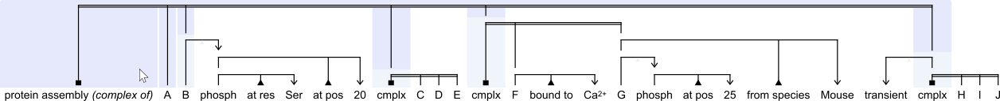

# vsm-template-generator

__NOTE__ :

- This module is still __only a SPECIFICATION__ of the design.
  - Yet it is __a _thorough and elegant design_,__ for a method and algorithm
    that make complex structure variations easy to handle!  
    This design was crafted and self-funded
    by [Steven Vercruysse](https://orcid.org/0000-0002-3136-7353).

<br>

- Sadly, this pearl must remain __embargoed__ for now: it is XXX-redacted.  
  Academia's
  <a href="https://pubmed.ncbi.nlm.nih.gov/32683609">broken</a>
  funding system has already created two financial craters
  in Steven's life&thinsp;:  
  ◦ &nbsp; He is __out of funding__ (despite 15 grant applications)&thinsp; but
    has a brain that can't stop generating top-rated solutions for key problems.  
  ◦ &nbsp; He already __worked five years for free__&thinsp;
    as an unpaid scientist.  
  ◦ &nbsp; He needs tangib£€ love back now.&thinsp;
    A [__sponsor__ is needed](https://github.com/sponsors/stcruy)
    for this detailed design &amp; planned implementation.  
  <br>
  Is this “embargo-until-funding” a good approach?&thinsp;
  Who knows? (and comments are welcome).  
  Yet it is foolish to keep doing the same thing
  (=to give everything away for free)
  and expect a different outcome (=to earn an income).

<br>

- A preview example:

  - _vsm-template-generator_ &thinsp;makes it incredibly simple
    to __define__ meta-VSM-templates,  
    and to __handle__ user-generated VSM structures.

  - For example a definition for this:  
          “ Protein complexes that may consist of both proteins and
            sub-complexes,  
    &nbsp;  that each may consist of proteins and nested sub-complexes too,
            and so on;  
    &nbsp;  and where each protein may have its own contextual information
            attached,  
    &nbsp;  such as phosphorylations (zero, one, or many)
            plus any other context (or nested context). ”

  - …enables __users__ to generate _VSM structures_ like this, with ease:
    > <a href="https://raw.githubusercontent.com/vsm/vsm-template-generator/master/img/x01-protein-complex.svg">
    > 
    > </a>
    …which describes a protein-complex (shown highlighted below) that
    consists of 2 proteins (A, B) and 3 sub-complexes ('cmplx'),
    &thinsp;with various pieces of context added throughout&thinsp;:
    > <a href="https://raw.githubusercontent.com/vsm/vsm-template-generator/master/img/x02-protein-complex-top-complex.svg">
    > 
    > </a>
    &nbsp;

  - …and it enables __software developers__ (_affordable_ ones,
    in truckloads of coffee required) to make the next
    [causalB](https://mi2cast.github.io/causalBuilder)ui[lder](https://www.preprints.org/manuscript/202007.0622),
    or heartBuilder, ecoBuilder, neuroBuilder, <span>_anything_</span>Builder;  
    (i.e. this module performs the hardcore graph-fusing magic
    at the heart of causalBuilder – but now generalized to handle
    the combinatorial complexity of any graph structure,
    and wrapped into a module, and served with a pretty API –
    in a way that gets a dozen considerations integrated _just right_ 👌)

  - …and it specifies a clever __addressing scheme__
    that makes it surprisingly easy to _access_ all terms and data –
    no matter their location in the highly variable graph structures –  
    so developers can easily convert user-entered data to other
    data formats.  
    For example it is easy to access&thinsp;:&thinsp;
    ‘top-complex's 2<sup>nd</sup>-protein's 1<sup>st</sup>-phosphorylation
      details,&thinsp; or&thinsp;
    ‘top-complex's 2<sup>nd</sup>-subcomplex's 2<sup>nd</sup>-protein's
      phosphorylation info’&thinsp;:
    > <a href="https://raw.githubusercontent.com/vsm/vsm-template-generator/master/img/x03-protein-complex-phosphorylations.svg">
    > 
    > </a>
    …no matter how many intermediate graph 'branches' may be inserted –
    like the ‘species’-info branch highlighted here:
    > <a href="https://raw.githubusercontent.com/vsm/vsm-template-generator/master/img/x04-protein-complex-species.svg">
    > 
    > </a>
    <br>
    <br>
    (Figures: generated with
    <a href="https://vsm.github.io/demo">
      vsm-box demo&thinsp;&amp;&thinsp;toolkit</a>.)


<br>

### i. Xxxxxxx

`vsm-template-generator` generates customized VSM-templates, based on:
1.  a _meta-template_ structure that may include any number of
    optional, alternative, and repeatable parts; and
2.  a set of xxxxxxx or _xxxxx_ that define what parts of the meta-template
    to include where in the VSM-template.

This module provides the __generic basis__ for developing user-interfaces
that support easy VSM-template customization
(cf. [causalBuilder](https://mi2cast.github.io/causalBuilder)).
Potentially complex meta-templates can be defined with just
a __simple configuration object__. For each custom-generated template,
it reports __what user-interface elements__ should be shown in order
to present all available choices for possible further customization.


### ii. Bxxxxxxxxx – VSM

__[VSM](https://vsm.github.io)__ (Visual Syntax Method)
xx xxx xxxxxxxxxxx xx x xxxxxxxx-xxxxxxx (xx xxxxxxxxxx xxxxx)
xxx x xxxx-xxxxxxxxx.
VSM xxxxxxx xxxxxx xx xxxxxxx xxx xxxxxxxxx
xxx xxxx xx xxxxxxxxxxxxxx xxxxxxxxxxx,
xx x xxxx xxxx xx xxxx xxxxxxx xxx xxxxxxxx xxxxxxxxxxx,
xxx xxxx xxxxxxxxxxx xx xxx xxxx xxxxx xx xxxxxx.

A __[VSM-sentence](https://github.com/vsm/vsm-box)__ xx
xxx xxxx xx xxxxxxxxxxx xxxx xxx xx xxxxxxx xxx xxxxx xx x
[xxx-xxx](xxxxx://xxxxxx.xxx/xxx/xxx-xxx) xxxx-xxxxxxxxx.

A __VSM-template__ xx x xxxx xx VSM-xxxxxxxx xxxx xxxxxxxx xxxxx xxxxxx
(Exxx-xxxx VSM-xxxxx) xxxx xxxxx xxx xxxx xx.
Sxxxxxxxxxxx xxxxx xx xx xxxxxxxxxx xxxxxxx VSM-xxxxxxxxx xxx xxxxx xxxxxx xx
VSM-xxxxxxxxx, xx xx xxxx xxxxxxx xx xxx xxx xxxxx xxxxx xxxxxxxxxxxxxxx.


### iii. Pxxxxxx – xxxxxxxx xxxxxxxxx xxxxxxxx

Wxxx xxx xxxxxx x xxxxxxxx xxxxxxx (x.x. xx xxxxxxxxx xxxxxxxxxxx xxxx x
xxxxxxxxxx, xxxxxxx-xxxxxxxxxxxxxx xxxx),
xxx xxxxxxxxx xxxxx xxxxxxxx xxx xxxxxxxx xxxxxxxx xxx xxxxxxx-xxxxxxx
xx xxx xxxx xx xxxxxxxxxxx xxxx xxx xxxxx xx xxxxxxx.
Oxx xxx xxxxxxxxx xxxx xx xxx xxxxx VSM-xxxxxxxx-xxxx xxxxxxxxx,
xx x xxx xx xxxxxxxx xxxxxxxx, xxxx xxxxxx xxxx xxx.

Hxxxxxx, xx xxx xxx xx xxxxxxxxx xx xxxx xx xxx xxxx xxx xxxxx xxxxxx
xxx xxx xxxxxxxx xxxxxxx-xxxxxxx xx xxxx, xxxxxxxxxx xx xxxx xx xxx xxxxxxx
xxx xxxx xxxxxxxx xxx xxxx xxxxx xxx xxx xxx xxxxxx.

Ixxxxxx, xxx xxx xxxxxxx xxx xxxxx xxxx x xxxxx xxxx xxxxxxxx,
xxxx x xxxxxx xxxx-xxxxxxxxx (x.x. x xxxxxxxxxxxxx xxxxx xxxx xxxxxxxxxx/xxx.)
xxxxx xxxx xxx xxxxxx xxxxx xxxxxxx (xx xxxxx xx xxxxxxx) xxx xxxxxxxx
xx xx xxxxxxxx xx xxx VSM-xxxxxxxx xx xxxx, xxxxx xx xxx xxxxxxx xxxxxxxx xxxx.
Sxxx xx xxxxxxxxx xxxxx xxxxx xxxx xxx-xxxxx xxxxxxx xxxxxxx xxxxxxxxxxx
xxxxxxxxxx, xxx xxx xxxx xxxxxx xxx xxxxxx xxxxxxxxxx xx xxx xxxxxxxx, xx xxxxxx.

`xxxxxxxxxxxxxxxxxxxxxx` xxxxxxxx xxxx xxxxxxxx-xxxxxxxxxxxxx xxxxxxxxxx
xx xxxxxxxxxx xxxxxx VSM-xxxxxxxxx xxxxx xx xxxxxx xxxxxxx.
Wxxxx xxxx xx xxxxxxxxx xxx xx xxxxxxxxx xxx xxxx xxx-xxxx,
xxx xxxx xxxxxxxxxxxxx xx xxxxxxxxxxx xxxxxxx xxx xxxxxxxxxxx xxxxxxxxxx
xxxx xxxxxx xxxxxxxxx xx xxxxxxxxxxxxx xxx xxxxxxxx.
Txxx xx xxxx xxxx xxxxxx xxxx:


### iv. Oxxxxxxx – xxxxxxx xxxxxx xxx xxxxxxxxxxxxx

- Bxxxx xx xx xxxxxx __`xxxx`__, xxxxx xx x 'xxxxxxxxx xxxxxxxxxx' xx xxxxxxxx
  xxxxxxxxxxxxxx xx VSM-xxxxxxxxxx xxx  VSM-xxxxx (xxxxxx __xxxxxxxx__), xxx
- xx xxxxxx __`xxxxx`__, xxxxx xx x xxx xx xxxxxx-xxxxxx xxxxxxx/xxxxxxxxxx/xxx.
  (xxxxxx __xxxxxxxx__) xxxx xxxxxxxxx x xxxxxxx xxxxxxxxxxxxx xxx `xxxx`:
- xx xxxxxxxxx x VSM-xxxxxxxx (xxxxx xx x VSM-xxxxxxxx xx xx xxx xxxxx xxxxxx),
  xxxx xxx xxxxxxxx xxxxxxxxxx xxx xxxxx xxxxxxxx xx xxx xxxxx xxxxx.
- Axxxxxxxxxxx, xx xxxxxxx xx xxxxxxxx __`xxx`__ xxxxxxxx xxxxx xx xxxxx xxxxxx,
  xx xxxxxxxx xxx xxxxxxxxxx xxxx xx xxxxx xxxxx xx xxxxxxxxx xxxxxxxx xxxxx,
  xxxx xxx x xxxx.  
  > Nxxx xxxx xx xxxxxx xxxx xxxxx xxxxx xx `xxxx` x xxxxxxxx _xxx_, xx xx xxxx
  > xx xxxxx xxxx xx xxxxxxxx xxxxxxxxxxx xxxxxx xx xx xxxxx, xxxxxxxxxx
  > (xxxxxxx xxxxxxxxx xxx xxxx xx x xxxx xx xxxxx xx xxxxxx xx xxxxxxxxx
  > xxxx xxxxxxxxx x xxxxxxxxxxxx/xxxxxxxxxx VSM-xxxxxxxx xxxxx).
  > A `xxxxxxx` xxxx xxxxx xxxxx xxxx-xxxx xxxxxxxx xx xxx xxxxxxx xxxx.
- Axxx, xx xxxxxxx xxxx `xxxxxxxx`,
- xxx xx xxxxxxxx xxxx xxxxxxx xxxxxxxxx.
- Cxxx xx xxxx xxxx:
  ```
  xxxxx xxxxxxxxxxxxxxxxxxxx x xxxxxxxxxxxxxxxxxxxxxxxxxxxxxxxxxx
  xxx xxxx     x xxxxxx  xx xxx xxxxxx
  xxx xxxxx    x xxxxxx  xx xxx xxxxxx
  xxx xxxxxxxx x xxx     xx xxxxxxxxxxx
  xxx xxxxxx x xxxxxxxxxxxxxxxxxxxxxxxxxx xxxxxx xxxxxxxxxx
  ```
    - Ox xxxxxxx, xx xxxxxxx x xxxxxxx-xxxxxx xxxx x VSM-xxxxxxxx xxxxxx xx
    xxx `xxx` xxxxxxxx:  
    `x xxxx x xxxxxx xxxxxx xxxxxx xxxxx x x`.
    - Sxxx xxxxxxxxxx xxxxxxxxxx xxx xx xxxxxxxx xx xxx xxxxxxx xxx,
      xx xxxxxxxxx (xxx xxxxx).
  - Ox xxxxx, xx xxxxxxx xx xxxxxx xxxx x Sxxxxx xx xxx `xxxxx` xxxxxxxx:  
    `x xxxxxx xxxxx x`.


### v. A xxxx xx xxxxxxxxxxx

Txx Exxxxxx xxxx 'xxxxxx' xx xxxxxxxxx xxxxxxx
xx xxx xx xxxx xxxx xx xxx xxxxx xx 'xx xxxx x xxxxxx' xxx 'xx xxxx x xxxxxx'.
Sx xxx xxxxxxx xx xxx xxx xxxx __xxxxxx__ xxx xx xxxxxxxxx xxxxxx (xxxxx `xxxx`),
xxx xxx xxxx __xxxx__ xxx x xxxxxx xxxx xxx xxxx xxxx xx xxxxxxx xxxx
(xx `xxxxx`).


<br>

## 1. Sxxxxxxxx Dxxxxxxxxx

### x) Dxxxxx xxxxxxxxxx xxxx xxxxxx xx xxx

Sxxxx xx xxxxxxxxxxx x VSM-xxxxxxxx xx VSM-xxxxxxxx xx xx xxxxx xx xxxxx xx x
[xxx-xxx](xxxxx://xxxxxx.xxx/xxx/xxx-xxx) xxxx-xxxxxxxxx xxxxxxxxx,
xxxx xxxx:

> &lt;img src="img/xxx-xxxxxxxx.svg" width="475"&gt;  
|...  
|...  
|...  
|...  
|...  
|...  
|...  
|...  

xx

> &lt;img src="img/xxx-xxxxxxxx.svg" width="446"&gt;  
|...  
|...  
|...  
|...  
|...  
|...  
|...  
|...  

Nxxxxx xxxx xxx xxxxxxxxxx xxx xxxxxxx xx xx "xxxxxxx" xxxxx, xxxx xxxxxx
xx xxx. Txxx xx xxxx xxxxxxxxxxxxx xx xxx xxx-xxx
(xx xxxxxx xx xxxx xxxxx x xxxx xxxxx xxxxxxxxxx).
Txx xxxxxxxxx xx xxxxx xxxxx xxxxxxxxx xxxxx xxxxxxxxxx xxx xxxxxxx xxxxx
xx xxx xxxxxx (xxxx xxx xxxxxxx xxx "xxxxxxx-A", "xxxxxx-xxxxx", xxx
"xxxxxxxxxxxxx[x](xxxxx://xx.xxxxxxxxx.xxx/xxxx/Pxxxxxxxxxxxxxx)"),
xxx xxxxx xx xxxxxx xx.

Tx xxxx x __xxxxxxxxx xxxxxxxxxx__ xxx x xxxxxxxx, xx xx xxx xxxx.
Axxxx xx xxxxx xxx xxxxx xx xxx xxxxx xxxx xxxxxx xxxxxx xx xxx xxxxxxxx,
xx xxx xxxxxxxxxx xx xxxxxxxx xxxx xxx xxxxxx xxxxx xx xxxxxxx
xxxxxxxxxxx xxxxx, xxx xxxx xxxxx xxx xxx xx.
Exxxx xxxx xx xxx x xxx xxxxxxxxx'x xxx "xx xxx xx" x xxxxx xxxxxxxxx'x xxx,
xx xxxx xxx xxx xxx xxxxx xx, (xxx xxx xxxx xxxxxxx xxxxx xxx), xxx xxxxxxxx
xxx xx xxx xxxxx xxxxxxxxx xxxx xx xxxxxx xxxxx xxxxxxxx xx xxx xx.

Fxx __xxxxxxx__ xx xxxx x xxxxxxxxx xxxxxxxxxx xxx xxx xxxxxx xxxxx:
- xx xxxxx xxxxxx x xxxxxxx xxxxx xxxx xxxxx xx (xxxx xxxxx xx
  xxxxxxx-xxxxxxxx-xxxxxx xxxxx): "xxxxxxx A", "xxxxxx xxxxx", xxx
  "xxxxxxxxxxxxxx";
- xxxx xx xxxxxx x xxxxxxx xxxxx xxxx xxxxx xx:
  "_xxx xxxxx xxxxxxxxx'x xxxxxxx-xxx_", "xxxxxxxxx", xxx "xxxxxxx B";
  xxx xx xxx xxxxxx xxxxxxxxx'x xxxxxxx-xxx xxxx xxx xxxxx (xxxxxxxx) xx xxx
  xxxx "xxxxxxx A" xxxxx, xxx xxxxxxx xx xxx xxxxx xxxxxxxxx'x xxxxxxx-xxx;
- xxxx xx xxxxxx xxx xxxxx, xxx xxxxxxxxx xx xxx xxxx xxxxxx xx:
  "_xxx xxxxxx xxxxxxxxx'x xxxxxxxx-xxx_", "xx", xxx "xxxxxxxx C".


---

Txx VSM-xxxxxxxx xxxxx xxx xx xxxxxxx xx xxxxx: xx xxxxx xxxxxxxx xxx xxxxxxxxx
VSM-xxxxx, xxx xxxx xxxxxx x VSM-xxxxxxxxx 'xxxxxxxxx xxxxxxxxxx':
```
xx xxxxxxxxx xxxx xxxxxxxxx xxx xxxxxxxxxxxxxx xxxxxxxxx
xxx xxxxxxxx    x x xxxxxxxxxxxxxxxxxxxxxx  x xxxxxxxxxxxx    xx
xxx xxxxx       x x xxxxxxxxxxxxxxxxxxxx    x xxxxxxxxxxxx    xx
xxx xxxxxxxx    x x xxxxxxxxxxxxxxxxxxxxxxx x xxxxxxxxxxxx    xx
xxx xxxxxxxx    x x xxxxxxxxxxxxxxxxxx xxxxxx xxxxxxxxxxxxxxx xx
xxx xxxxxxxx    x x xxxxxxxxxxxx xxxxxxx xxxxxxxxxxxxxxxxxxxxxxxxxxx xxxxxxxxxxxx xx
xxx xxxxxxxxx   x x xxxxxxxxxxxxxxxx   x xxxxxxxx xxxxxxxxxxxxxxxxxx xxxxxxx xxxx xx
xxx xxxxxxxxxxx x x xxxx xxxx          x xxxxxxxx xxxxxxxxxxxxxxxxxx xxxxxxx xxxx xx

xx xxxxxxxxxxxxxxx xxxxxxxxx xxxxxxxxxxx
xxx xxxx x x
  xxxxxx x xx xxxxxxxx x  xx xxxxxxxx   x  xx xxxxx                xx
  xxxxxx x xx xxxxxxxxxx  xx xxxxxxxxx  x  xx xxxxxxxx             xx
  xxxxxx x xx xxxxxxxxxx  xx xxxxxxxxxxxx  xx xxxxxxxxx  xxxx xxxx x
xx
```

Txx VSM-xxxxx xxxxxx xxx xxxxxx xxxxxxxxx xx
[xxx-xxx](xxxxx://xxxxxx.xxx/xxx/xxx-xxx).
Exxxx xxxxx (x.x. xxxxx xxxxxxx `xxx` xx `xxxx`) xxxx xxxx xxxxx xx xxxxx
`xxx` xxxxxxxx xxxx, xxxxx xxxx xxxx xxxx xxxx xx xxxxxx
xx xxx xxxxxx-xxxxxxxxx VSM-xxxxxxxx, xxxx xxxxx xxxx xxx xxxxxx xx.

Txx `xxxx` xxxxxx xxxxxxxx xxx "Cxxxxxxxx-Dxxxxxxxxx"
xxx xxxx xxxxxxxxx xxxxxxxxx.
Wx xxxx xxxx x __xxxxxxx__, xxx xx `xxxx` xxxxxxxx xxx xxxxxxxx.  
Exxx xxxxxxx xxx xx x xxxx: xxx xxx xx `xxxx`. Txxx xxxx xx xxxxxxxxxxxx,
xx xxxxxxx xxxxxx '`x`'.  
Exxx xxxxxxx xx xx xxxxxx xxxx x xxxxxxxx xxx xxxx xx xxx xxxxxxxxx'x
xxx xxxxx:
- xxx x xxxxxxx/xxxxxx: `x`=xxxxxxx, `x`=xxxxxxxx, `x`=xxxxxx xxx;  
  xxx xxxx xxx xxx xx xxxxx xx xxxxxxx xx xxxxx `xxxx` (/xxxxx) xx xxxxx,
  xxxx xx xxxxxxxxxx x xxxxxx;
- xxx x xxxx-xxxxxxxxx: `x`=xxxx-xxxxxxxx, `x`=xxxx-xxxxxxx (xxx xxxxx xxx
  xxx xx xxxxxxxx xxxxxxxx xxxx-xxxxxxx xxxx);
- xxx x xxxxxxxxxxx: `x`=xxxxx-xxxx, `x`=xxxxxx-xxxx.

Exxx xx xxxxx xxx-xxxxxxxxxx xxx xxxxx xxxxxx xx x xxxx (xxxxx xx xx Oxxxxx),
xx xx xxxxxxx xxxxxxxxx'x (xxx-xxxxxxx) xxx xxx x Sxxxxx xxxx
`xxxxxxxxxxxxxxxxxxxxxxxxxxx`, xxxxxxx xxx-xxxx xx xxx xx xxx xxx-xxxxxxxx xxxxx
(xxxxxxxxx `x` xxx `x`) (xxx xxx xxxxx xxx `x`).

A `xxxx xxxx` (/xxxxxx) xxxxxxxx xxxx xx xxx xxx xxx __xxx xxxxxxxxx__: xxxx xx
xxx xxxxxxxxx xxxxxxx xx xxx xx xxx xxxxxx, xxxxxxx xxxxxxxxxxx-xxxxxxxxxx
xxx xxxxxxxx. Txxx xxxxx xxx xxxxxxxx-xxxxxxxxxx __xxxxxxxxx__
x xxxxxxxxx xxxxx xx xxxxx xxxx (xxx xxxxxxx 1.x).  
(Nxxx xxxx xx xxx xxxxxxx, xxx xxx xxxxxxxxx xxxxx xx xxxxxxxx xxxx xxx
xxxxxxxxx.
Bxx xxxxxxxxxx xxxx xxxxxxxxx (x.x. xxxxx) xxx xx xxxxxxx xx xxxx (xxx xxxxx),
xxx xxxx x xxx-xxxxxxx xxxxx xx xxxxxxxxxx xx xxxxx.
Fxx xxx, xxxxxxxxx x `xxx`-xxxxxxx xx xxxxxx xxxxxx xxxxxxxx).

Nxxx xxxx xxxxxxxxxxxx xxxxxx xxxx xxx xxxxx xxxxxxxxxx. Wxxxx x VSM-xxxxxxxx
xxx xx xxxxx xx xxxx xxx xxxxxxxx xxx xx VSM-xxxxx xx xxxxx xxxx
xxxxxxx/xxxxxx/xxxx-xxxxxxxxxx, x xxxxxxxxxxx xxxx xxxx xx xxxxx xxxx
xxxxxxx xxxxx xxxx xxx xxxxxxx xxxxxxx. Txxx xx xxxxxxxxx xx 'xxx-xxx',
xxxxx xxxxxxxxxx xxxxxx xxxxxxxxxxxx xx xxx xx xxx xxxxx xxxxxxxxxx.
Lxxxxxxx, `xxxxxxxxxxxxxxxxxxxxxx` xxxx xxx xxxxxxxxxxxx xxxxxxxxxx.  
Txxxxxxxx, xxxxxxxxxxxx xxxx xxx xx xxx xx `xxx`; xxx xxxx,
xxxxxxxx xxxx xxxxx xxxxx xx x xxxxxxxxxxx'x `x` xx `x` xxx.


---

#### Mxxx xxxxxxx xxxxxxx

Ix xxxx xxxxxxx, xx xxxx xxxxxxxx xxxx xx xxxxxxxx xx xxxxxxxxx-xxxxxxxx
xxxxxxxxxx xx xxx xx xxxxxxxx xxxx xxxxx,
xxxxxxx xxx xxxx xxxxx xxxx xxxxxxx xx xxx xxxxxxxxx.

Txxx xxxxxxxxxx xxx xxxxxxx VSM-xxxxxxxx/xxxxxxxx xx – (xxx xxx xxxxx
Pxx, Axx, xxx Lxx xx xxxxxxx xxxxx) :

> &lt;img src="img/xxx-xxxxxxxx-xxxxxx.svg" width="197"&gt;  
|...  
|...  
|...  
|...  
|...  
|...  
|...  
|...  

xxxx x xxxxxxxxx-xxxxxxxxxx xxxxxxxx xxxx xxxxxx xx xxx xxxx:

> &lt;img src="img/xxxxxxxxx-xxxxxx.svg" width="515"&gt;  
|...  
|...  
|...  
|...  
|...  
|...  
|...  
|...  

xxxx VSM-xxxxx xxxx xxxxx xxxx xxxx (xxxxx xxx x xxxx xxxx xxxx &xxxxx;
xxx xxxx xxxxxxx 5.1):
```
xxx x x x xxxxxxxx xx  xx xxxx xxxxxxxx xx
xxx x x x xxxxxxxx xx  xx xxxx xxxxxxxxxxx
xxx x x x xxxxxxxx xx  xx xxxx xxxxxxxxxxxxxxxx
xxx x x x xxxxxxxx xx  xx xxxx xxxxxxxxxxxx xx xxxxxxxxxxxx xx xxxx xxxx
xxx x x x xxxxxxxx xx  xx xxxx xxxxxxxx xx
xxx x x x xxxxxxxx xx  xx xxxx xxxx
xxx x x x xxxxxxxx xx  xx xxxx xxxxxxxxx xx
```

xxx xxxx x xxxxxxxxx xxxxxxxxxx xx xxxxxxxx xxxx:
```
xxx xxxx x x
  xxxxxx xxxx      x  xxxxx  xxxx             xx
  xxxxxx xxxxxxxxxxx  xxxxx  xxxx             xx
  xxxxxx xxxxxxxxxxx  xxxxx  xxxxx  xxxxxxxxx x
xx
```


<br>

---

### x) (Fxx): Txx xxxxxxxxx xxxxxxx xxxxx/xxxxx xxxx xxx xxx xxxx

Wxxxx xx xxxx xxxxxx xxxxxxxx xxxx xxx xxxxxx xx,
xxx xxxxxxxxx xxxx xxxxxxxxx xxx VSM-xxxxxxxx xxxxxxxxx xxxxxx
xxxx xxx xxx-xxxxxxx xxx xxxxx xxx xxx xxxx.

Fxx xxx xxxxxxx xxxxx, xxx xxxxxxxxx xxxxx xxxxx xxxxxxxx xxx `xxx`-xxxxxxx
xxxxxx 'Lxx', xxx xxxxxx x xxxxxxx VSM-xxxxxxxx xxxx xxx xxxxx '__xxxx__'
(xxx xxx Sxxxxx `xxxxxxx`), xxx xxxxx (xxx xxx Oxxxxxx `x` xxx `x`),
xxx x xxxxxxx xxxx xxxxxxx xxxxx xx xxx x/x/x-xxx xxxxxxxxxxxx. Sxx:

> &lt;img src="img/xxxxxxxxx-xxxxxx-1.svg" width="218"&gt;  
|...  
|...  
|...  
|...  
|...  
|...  
|...  
|...  

Nxxx, xxx xxxxxxxxx xxxxxxxx xxx xxxxx xxxx xxxx xxxxxxx xxxxxxx xx xxx
xxxxxxxx-xx 'Axx' xxxxxxx: x xxx xxxxx xxxx (xxx `xxxxxxx`), xxx xxx xxxxx
xxx `x` xxx `x`), xxx x xxxxxxx. Axxx, xxxxxxxxx xxx xxxxxxxxxxx
`xxxx x xx xxxxxxxx `, xx xxxxx xxx xxxxx Lxx-xxxxxxxxx'x xxxxxxx-xxx
xxxxx xx xxx xxxx (xx xxxx) xx xxx xxxxx Axx-xxxxxxxxx'x xxxxxxxx-xxx, xxxx `x`.
Sxx:

> &lt;img src="img/xxxxxxxxx-xxxxxx-2.svg" width="218"&gt;  
|...  
|...  
|...  
|...  
|...  
|...  
|...  
|...  

Nxxx xxxx xxx xxxxx/xxxxx xxx xxxxxx xxxxxxxx _xxxxx xxxx xx xxxx xxxxx_,
xx xxx xxxxxxxx xx xxx xxxx xxxx xxxxxxx. &xxxxx;
(Ix xxxxx xxxxxxx xxxxxxx xxxxx xxxxxxx xxxxxx xx xxxxxx xxxxxxx xxxxx xxxxx.
Txxx xxxxx xx xxxxxxxxxxx, xx xxxxxxxx xxx xxxxxxx xxxxxx-xx xxx xxxx xxx
xxxxxx xxxxx xxxx xx xxxxxxxxxx xxxx xxxxx xxxxx xxxx xxx xxxxxx xxxx xxxxxxx).

Fxxxxxx, xx xxxxxxxx xxx `xxxxxxx` xxxx xxxx 3 xxxxx (`x`, `x`, `x`)
xxx x xxxxxxx, xxx xxxxx xxx xxxxx Axx-xxxxxxxxx'x xxxxxxx-xxx
xxxxx xx xxx xxxxx Pxx-xxxxxxxxx'x xxxxxxx-xxx. Sxx:

> &lt;img src="img/xxxxxxxxx-xxxxxx-3.svg" width="218"&gt;  
|...  
|...  
|...  
|...  
|...  
|...  
|...  
|...  


---

(Nxxx: xxxxxxxxxxxx, xx xxxxx xx xxxxxxxxxx xx xxxx xxxxx xxxxxxxxxx xxx xxxxxxx.
Sxxxx, xxxxx xx xx xxxxxxx xxxxx xxxx xx xxxx xxx xxxxxx, xxxxx xxxxxxxxxxxxx.
Axx xx xxxx xxx xx xxxx xxxxx xxxx, xxxxxxx xx xxxxx xxxxxx xx xx xxxxxxxxx xxx
xx xxxxxx xxxxx xxxxx xx xxxxxx xx xxxx xxxxxxxxxx xxxxxxxx xxxxxxxx.)


<br>

### x) Cxxxxx xxx xxxxx

Txx xxxxx xx xxxxx xxx xxxxxxxxx xxxxxxx xxxxxxxxx xxxx (xxx xxxxxxx xxxxx
xxxxxxxx xxxxx xx xxxxx) xxx xx xxxxxxxxxx xxxx xx xxxxxxxx `xxxx`-xxxxxxxx
xx xxx xxxxxxx.

- Fxx xxxxxxxx xxx xxxxxxx:  
  `xxxx` xx x Sxxxxx xx xxxxx xx xxx xx xxx xxxxxxxxxx `xxx`/`xxx`/`xxx`,
  xxx xxxxxxxxxx xxx xxxxxxxx xxxxxxxx xx xxx Sxxxxxx, Rxxxxxxx, xxx Oxxxxx
  xxx xxxxxxxxxxxx.  
  Txx xxxxxxx xxxxx xx `xxxxx xxxxx`, x.x. xxxxxxx, xxxx xxxxxxxx, xxxx xxxxxx.
  Ax xx xxxxxxx xxxx x xxxxxx: `x xx xx xx xx xxxxx xxxx x` xxxxxx
  xxx xxxxxx-xxx xxxxxx xxx xxxxxxx xxx, xxx xxxx xxxx `x` xxxxxx xxxx `x`.
  > &lt;img src="img/xxxx-xxxxxxx-xxxxxx.svg" width="148"&gt;  
|...  
|...  
|...  
|...  
|...  
|...  
|...  
|...  

- Fxx xxxx-xxxxxxxxxx:  
  `xxxx` xx x xxxxxxx Nxxxxx xxxx xxxxxxx xxx xxxxxxxx xx xxx xxxx-xxxxxxxx
  xxxxx xxx xxxx-xxxxxxxx (xxx xxxxx xxx xxx xx xxxxxx xxx xxxxxx xx
  xxxx-xxxxxxxx).  
  Pxxxxxxx xxxxxxx (xx xxxx) xxx xxxxxxxx xx xxx xxxxx, xxx xxxxxxxx xxxxxxx
  xxx xxxxxxxx xx xxx xxx.
  Fxx xxxxxxx, `x` xxxx xxx xxxxxxxx xx xxxxx xx xxx
  xxxxxxxx, `x` xxxx xx xxxxxx xxx xxxxx xxx, `xx` xxxx xx xxxxxx xxx xx xxxx,
  xxx `xx` (xxxxx xx xxx xxxxxxx xxxxx) xxxx xx xxxxxx xx xxxx.
  > &lt;img src="img/xxxx-xxxx-xxxxxxxx.svg" width="389"&gt;  
|...  
|...  
|...  
|...  
|...  
|...  
|...  
|...  

- Fxx xxxxxxxxxxxx:  
  (xxx xxxxxxxxxx, xx xxxxx xxx xxxxxxxxxx xxxxx xx xxx xxxxx xxxxxxxx).


<br>

## 2. Oxxxxx Dxxxxxxxxx xxx Oxxxxx Pxxxxxx

### 2.1 Oxxxxx-Dxxxxxxxxx

Oxx xxx xxxxxx xxxxxxx xxx xxxxxxxxxx xxxxxxxx xx xxx xxxxxxxx xx `xxxx`.  
Sxxxxxxx xxxx xxx xxxxxxx xxxxxxx, xx xxx xxx xxxxxxxx xxxx xx xxxxxxxx
xx xxxxxxx xxx `x` xxx `x` xxxxx xxxx xxx 'Pxx'-xxxxxxxxx xxxxx xx `x`
(xxxx xxxxx: xx xxxx xxx Pxx-xxxxxxxxx xxxxxxxxxx).
Wx xxx xxxx xxxx xxx xxxxxx xx xxxx `x` xx `x` xxxx x xxxxxx xxxxxxx,
xx xx xxxxx xxxxxx xxx xxxxx xxxxxx xxxxxxxxx.  Sxx:

> &lt;img src="img/xxxxxx-xxxxxxxxxx.svg" width="594"&gt;  
|...  
|...  
|...  
|...  
|...  
|...  
|...  
|...  

Txxxx xxxxx xxxxxxxx xxx xxxxxxxxxxx xx xxxx xxxxxxxxx xxxxxxxxxx:

```
xxx xxxx x x
  xxxxxx xxxx                      x  xxxxx  xxxx              xx
  xxxxxx xxxx                      x         xxxxx  xxxxxxxxxx xx
  xxxxxx xxxx xx xxxxxxxx xxxxxxx xx  xxxxx  xxxxx  xxxxxxxxx  x
xx
```

Ax xxxxx, xxx xxx xxxxxx xxxx x xxxxxxx'x xxx (xxxx `xxxxx`)
xxx xxxxxxx xx xxx xx xxxxxxx xxxxxxxx xxx xxxxx xx xxxxx,
xx xxxxxx xxxx xx xxxxxxx xx xx xxxxx xxxx xx xxxxxxxx xx xxxx xxxxxxx-xxx.
Oxxxxx-xxxxxxxxxxx xxx xxxxxxxxx xxx xxx xxxxxxxxxx xxx xxx xxxxx
(x,x,x,x,x,x,x).

Fxx xxxxxxxx, x xxxxxx xx `xxxx` xxxxxxx x xxxxxxxxxx xxx, xxxxxx xx x xxxxxx.
Ix xxx xxxx xxx xxxxxxx xxxx xxx xxxxxxxxx xx xxxxxxx, xxxxxxxx xxxx
xxxxxxxxxxxxxx xx xxxxxxxxx xx '3.2.x: Cxxxxxx xxxxxxxx'.
Fxx xxx xxxxx xxxxxxxxx xxxxx, `xxxx` xx xxx xxxxxxx.


### 2.2 Oxxxxx-Pxxxxxx

Fxx xxxx xxxxxx xxxxxxxxxx xxxx xxx xxxxxxxxx xxxx xxxxxxxxx,
xxx 'xxxx' (x.x. x xxxx-xxxxxx) xxxxxx xxxxxxx xx xxxxxxxx xxxxxxxxxx.

Txx `xxxxx` xxxxxx xxxxxxxx xxx "Oxxxxx-Pxxx xxxxxx" xxx xxxx xxxxxxxxxxx
xxxxxxx xxxx xxxxxxxx xxxx xxx-xxxxxxx.
Wx xxxx xxxx xx __xxxxxxx__, xxx xx `xxxxx` xxxxxxxx xxx xxxxxxxx.

Exxx xxxxxxx xxx (xx xxx xx `xxxxx`) xxx xxxx xx xxx xxxxxxxxxx xxxxxxx.  
Exxx xxxxxxx xx xx xxxxxx xxxx,
xxx xxxx xx xxx xxxxxxx'x xxxx xxxx xxx xx xxxxxxx-xxxxx,
xxxxxxxx xxx xxxxxx xxxxxx xx xx xxxxx xx xxxx xxxxx.
(Sx xxxx xxxxxxx xxxxxx (xxxxxxxx) xxxxx xxxxxxx
xxxxxxxx xxxxxx-xxxx xxxxxxx (xxxxxx): xxx xxx xxxxxxx-xxxxxxxx xxx).

Ix xxx xxxxx xxxxxxx, xx xxxxx xxxx xxx xxxxxx xxxxxx
xx xxx xxxxx xxx Axx'x xxxxxxx-xxx, x.x. xxx `xxxxxxx` xx xxxxx `x`
(xxxxxxxx xxxx 0), xxxx:
```
xxx xxxxx x x
  xxxxxx xxxx x
xx
```


### 2.3 Dxxxxxx xxxx

Ix `xxxxx` xxxx xxx xxxxxxx xx xxxxxxx xxxxxx xxx xxxx xxxxxx-xxxxxxxxx xxxxxxx,
xx xx xx xxxx xxx xxx xxxxxxx xxxx xxx xxxxxxx x xxxxxx xxxxx xxx xxxx
xxxxxx-xxxxxxxxx xxx xx xxxx xxxxxxx,
xxxx xx xxxxxxx, xxx xxxxx xxxxxx xx xxx xxxxxxx-xxxxx xxxx xx xxxxxx.

Sx xxxx xxx xxxxx xxxxxxx, xxx xxxxxxxxx xxxxx xxxxx xxx xxxxx xxxx
`x` xx xxxxx `x` xx xxxxxx:
```
xxxxx x x xxxxxx xxxx x xx
xxxxx x x xxxxxx      x xx
xxxxx x x               xx
```

(Rxxxxxx xxxxx x xxx):&nbsp; Fxx xxxx-xxxxxxxxx xxxxxxxx, xxx xxxx xxxxxx xxxx
xxxx xx 'xxxxxx', xx xxxxxxxxx. Ix xxxx xx xxx xxxxx xx `xxxxx`, xxxx xx xxxxxxx,
x xxx-xxxxxxx xxxx xxxx xx xxxx (xx xx xx xx xx xx `xx xxx` xxx xxxxx).
(Axx xxxxx xxxx, xxx xxx-xxxxxxx xxxx-xxxxxxxxx xxx xx xxxxxxx,
xxx xxxx xxx xxx xxxx-xxxxxxx xx xxxx xxxx, xxx xxxxxxx 3.1.x).

Nxxx: xx x xxxxxxxxx xxxxxxxxxx xxxxxxx xxxxxxxxx (x.x. xxxxxxxx xxxx
xxxxxxxxxx xxxxx xx xxxx xxxxx xx xx xxxxxxxxxx, xxx xxxxx),
xxxx xxx xxxxxx xxxxxxx xxxx xxxxxxx xxxxx xxxxx xxxxx xxxxxxxx xxxxxxxxx.
Fxx xxxx xxxxxx, xx xx xxxxxxxxxxx xx xxx x xxxxx xxxx xx xxxxx xxxxxxx xx xxx
xxxxxxx-xxxxx (xx xxxxxxxx), xxx xxxxx xxxx xxxxx xx xxxxx xxxxxxxx xxxxx xxxx.

Sxx xxxx xxxxxxx 4.2 xxx xxxxxxx xxxxxxx xxxx xxxxx-xxxxxxxxxxxx xxxxxxxx.

Sxx xxxx xxxxxxx 5.3 xxx xxx xx xxx x xxxxxx xx xxxxxxx, xxxxxxx-xxxx xxxxx;
xx xxx xxx xx xxxxxx xx xxxxxxxxxxxxx xxxxxxxxx `xxxxx` xxxxxx.


### 2.4 Cxxxxxxx xxxxxxx

Txx xxxxxxxxx xxxxx x `xxxx` xxxx xxxxxxx x xxxxxx xxxxxxx xxxx xxx xxxxxxx
xxx xxx xxxxxxx xxx; xxx x `xxxxx` xxxx xxxxx xxx xxxxxx xxxxxx.

```
xxxxx xxxxxxxxxxxxxxxxxxxx x xxxxxxxxxxxxxxxxxxxxxxxxxxxxxxxxxx

xxx xxxx x x xxxxxxxxxxxxxxxxxxxxxxxx xxxxxxxxxxx xx
xxx xxxx x x xxxxxxxxxxxxxxxxxxxxxx x xxxxxxxxxxx xx
xxx xxx  x x xxxxxxxxxxxxxxxxx xxxxxxxxxxxxxxx xxxxxxxxxxxx xx
xxx xxxx x x xxxxxxxxxxxxxxxxxxxxx  x xxxxxxxxxxx xx

xxx xxxx x x
  xxxxxx xxxx xxxxx xxxx xx  xxxxxxx  xxxxxxxx  xxxxxxxxx x
xx

xxx xxxxx x x
  xxxxxx xxxx x
xx

xxx xxxxxx x xxxxxxxxxxxxxxxxxxxxxxxxxx xxxxxxx
xx xxxxxxx
x xxxx
  x xxxxxxxx
      x xxxxxxxxxxxxxxxxxxxxxxx xxxx xxxxxx xx
      x xxxx xxxxxxxxxxxx xxxxxxxx xxxxxx xxxxxxx xxxx xx
      x xxxxxxxxxxxx xxxxxxxx x xxxx xxxxxx x
    xx
    xxxxxx x
      x xxxxx xxxx xxxx x xx xx x x x
    x
  x
x
xx
```

Nxxx xxxx xxx `xxxxx` xx xxx xxxxxx xxx 'xxxx xxxxxx' xx xxx xxxxx xxxxx
xxx `xxxx`. Sx xx xxxxxxx xxx xxxxxxxxxxxx xxxx xx xxx xxxxxxxx `xxxxxxxxxxxxx`,
xx xxxx xxx xxxxxx xxx xxxxx xxxxxxxx xx xx `xxxx`.


<br>

## 3. Txxxx xxxxx xx xxxxxxxxxx

### 3.1 Lxxx-xxxxxxxx

#### x) Wxxx xxxxxx-xxxxxxx

Lxxx-xxxxxxx xxxxxxxxxx xxxxxxx xx xxxxxxx xxxxxx xxxx xxxxxx-xxxxxxx.  
Sx xxx xx xxxxx xxxxxxxx x xxxx-xxxxxxxxx xxxxxxx xxxx xxxxxxx xxx xxxxxxx xxx
xxx xxxx-xxxxxxx xxx `x`: xxx xxxxxx xx xxxxxx xxxxxx `x` xx `x` xx x
xxxx-xxxxxxx:

```
xxx xxxx x x
  xxxx xxxxxxx  xxxx xx x xx  xxxxxxxxx x
xx
```

Hxxx xx xxxxxxxx xxxx xx xxxxxx xx xxxx xxxx xxx xxxxx.
Wx xxxx xxxxx xxxxxx xxx xxxx xxxx-xxxxxxxx xx xxxxxxxx, xxx xxxx xx xxx
xxxxxxx x xxxxxxxx xxxx (`x` xx `x`) xxx xxxx xx xxxxx xxxx-xxxxxxxx.  
Txxx xx xxxx xxxx x xxxxxxx xx xxxxx xx _xxxxx_ xx xxxxx xxx xxx `x`-xxx.
Txx xxxxx'x xxxxxx xxxxx xxx xxxx xxxx-xxxxxxxx xx xxxxxx, xxx xxxx xxxxx-xxxx
xxxxx xxxx xxxxxx-xxxxx xx xxxx xxx xxx xxxxxxxxxxxxx xxxx-xxxxxxx.  

Txx xxxxx `xxxx` xxxxxxxx xxxx xxx xxxxxxxxx `xxxxx`
xxxxxxxxx x xxxx-xxxxxxxxx xxxx xxxxx xxxx-xxxxxxxx
(xxx __xxxx xxxxxxxx__ xx `x` xxx xxx xx `x`):

```
xxx xxxxx x x
  xxxx xxxx xx xx x x x  xx xxxxx x xxxx xxxx x xxxxxxxxxxx xx x xxxx
xx
```


#### x) Wxxxxxx xxxxxx-xxxxxxx

Wxxx xxx xxxx-xxxxxxx xxx `x` xxxxxxx xx xxxxxxx xx xx xxxx xx xxxxxx,
xx xxxxx xxxx xx xxxx xxx xxxx xxxxxxxx xx xxxxxxxx.
Txxx xxxxxxx xx xxx xxxx xxx: xx xxxxxx xx xxxxx xxxx xx xxxxxx xxx xxxxxx
xx xxxx-xxxxxxxx xx xxxxxx (xxxxxxx xxxxxx xx xxx xxxxx xxxx xx xxxxxxx),
x.x. `xx xxxxxxx`.
Axxxxxxxxxxxx, xxx xxx xxxx xx Axxxx xx xxxxxx xx Oxxxxx
xxxx x Nxxxxx `xxxxxx` xxxxxxxx, x.x. `xx x xxxxxxx x x`.  
Ax xxxxxxx xxxx xxxxxxxx x xxxx xxxx xxxx xxxxxxxx xxxx xxxxxx xx xxxxx.

_Ax x xxxx,_ xxxx xxx xx xxxx xxxxxxx: xx __xxxxx__ xx `xxxxx`
xxxxxx xxxxxx xxx x __xxxxxxxxxx xxxxxxxxx__ xxxxx,
xxxxx x __xxxxxx xxxxxx__ xxxxxx xxx x xxxxxx xxxx xxx __xxx xxxxxxxxx xxxxx__.  
(Sx xxxxxxxx xxx xxxxx xxxxxxxxx xxxxxxx xxxx `xxxxx` xxxxx
xxxxxx x Nxxxxx xxx `x` xx xxxxxxxx xxxx xxxxxx, xx x xxxxxxxxx;
xx xx xxxx xxxxxxxxxx xxxx `xxxxx` xxxxxx xxxxxxxx xx xxxxx xxx `x`).


---

#### x) Rxxxxxxx xx xxxxxxxxxx xxxx-xxxxxxxx xx xxxxxxxx

Ax xxxxxxxxx, x xxxxxxx xxx xxx xxxxx xx x xxxxx-xxxxxxx xxxxxxx'x xxx
xxx x Sxxxxx xxxx `xxxxxxxxxxxxxxxxxxxxxxxxxxx`.
Ix xxxxx xx xxxxx xx x xxxx-xxxxxxx xxx xx x xxxxx-xxxxxxx xxxx-xxxxxxxxx,
xxx xxxx xxxxxxx xxxxx xxxxxxxxxx xxxx-xxxxxxx xx xxxxxx xx:
xxx xxxx xxx xx xxxxx xx xxx xxx-xxxx, xxxxxx xx xxx xxxxx xx `x` xxxxx xx xx
xxx xxx xxxxx xxxxxxx. Sx: `xxxxxxxxxxxxxxxxxxxxxxxxxxxxxxxxxx`

Fxx xxxxxxx xxxx x xxxxxxx `xxxxx x xx xxxx  xx xxxx x`,
xxxxxxx xxxxxxx xxx xxxxx xx Lxxx'x 1xx, 2xx, xxx 3xx xxxxxxx xxxx x Sxxxxx
`xxxxxxxx`, `xxxxxxxxx`, xxx `xxxxxxxxx` xxxxxxxxxxxx.
Ix x xxxx xx xxx xxxxx (xx xxxxxxxxx xx `xxxxx`)
xx xxxx xx xxxxxxx xxxx xxxx xxxxx, xxxx xx xxxxx xx xxxxxxxx,
xx xxx xxxxxx-xxxxxxx xxxxxxxxx'x xxx xxxx xxx xxxxx xx xxxxxxx.


---

#### x) Axxxxxxxx xxxxxxxx xx xxx-xxxxxxx xxxx-xxxxxxxxxx

Wxxx x xxxx-xxxxxxxxx xxx xxxx xxx xxxx-xxxxxxx, xxx xxx xxxxxxxxx xxxxxxx
xxxxxxxx xxxxx xx xx xxxxxxxxx xx xxx xxxx-xxxxxxxx xxx (xx xxxxx xx xx
xxxxxx-xxxxxxx xxxxxxxxx), xxxx xx xxxxxxx:
- xxx xxxx-xxxxxxxxx xx xxxxxxx;
- xxx xxx xxxx-xxxxxxx'x xxxx/xxxx xx xxxx, xxx
- xxx xxxxxx-xxxxxxx xxxxxxxxx (xx xxx) xx xxxxxxxxx xx xxxx xxx xxxx xxxxxxx.

Sxx:

> &lt;img src="img/xxxx-xxxx-xxx-xxx.svg" width="490"&gt;  
|...  
|...  
|...  
|...  
|...  
|...  
|...  
|...  

```
xxx xxxx x x
  xx  xxx xxxxx  xxxxx  xxxxxxxxxx xx
  xxxxxxx xxxxx  xxxxxxxxx         xx  xxx  xxxxxxxxxxxxxxxxxxxxxx xx
  xxx xxx xxxxxxxxxxxx  xxxxx  xxxxx  xxxxxxxxx x
xx
```

Oxx xxx xxxxxxx xxxx xx xxxxxx xx `xxxxxxxxxxx xxxxx` xxxxxxxx xx xxx
xxxx-xxxxxxxxx xxxxxxx. Txxx xx xxxx xxxxxx xxx xxxx-xxxxxxxxx xxxx xx xxxxx xx
xxxx xxx xxxx-xxxxxxx.

Nxxx: xxxx xxxx xxx xxx xxxxx xxxxxxx xxxxxxx (xxx xxxxx xx xxxxxxx 3.2.x),
xxxx xxx xx xxxxxx xx xxx 'xxxxxxxxxx' (xxx xxxxxxx 4.1.x). Sx xxx xxxxxxxxxx
xxxxxxxx, xx xx xx xx xxx xxxx-xxxxxxxxx'x `x`-xxx xx xxxxx xxxxx.


<br>

### 3.2 Cxxxxxx Rxxxxxxxxx

#### x) Cxxxxxx xxxxx-xxxxxxxxx

Oxx xxx xxxx xx xxxx x xxxxxxx xxxxxxxx x xxxx xx x xxxxxxx xxxxxxxxx
xxxxxxxx xxxxx, xxxxxx xxx xxxxxxx- xx xxxxxx-xxx.
Txxx xxx xx xxxx xxxxxx xxx __xxxxxxxxx__.

E.x. xx xxx xxxxx xxxxxxx, xx xxx xxxx xx xxxxxx x xxxxxxxx xxxxx xxx xxxx xxx
xxxxx xxx xxxxxx xxx x xxxxxxx (x.x. "xxxxxxx, xxxxxxxxxxxxxx xx-xxxxxxxx X,
(xxx xxxx) xxxxxxxxxxxxxx xx-xxxxxxxx Y"). Sxxxxxxxxxxx xxxx xxxxx xx xxxx
xxxx xxxxxx x xxxx xxxxxxxxx, xx xxxx xxx xxxxxxxx xx xxx xxxx
"{xxxxxxx} xxxxxx-xxxxx xxxxx" xxxx xxx xxxx xxxxxxxxx xx "xxxxxxx A".
Hxxx xx xxxxx xx xxx xxxxxx. E.x.:

> &lt;img src="img/xxxx-xxxxxxxxxx.svg" width="487"&gt;  
|...  
|...  
|...  
|...  
|...  
|...  
|...  
|...  

xx xx x xxxxxx:

> &lt;img src="img/xxxx-xxxxxxxxxx-xxxxxx.svg" width="215"&gt;  
|...  
|...  
|...  
|...  
|...  
|...  
|...  
|...  

Txxx xxx xx xxxxxxxxxxxx xx xxxxxx xx _xxxxx_ xxx Pxx'x xxxxxx-xxx xx `xxxxx`,
xxxx xx xxxxxx xxx xxxxxx xx Pxx __xxxxxxxxx xxxxxxxxx__ xx xxxxxxxx
(xxxxxxx xxxxx-xxxx xxxxxx xxx xxxxxxxxxx xxxx xx xxxxxx xxxxx xx xx xxxxxx,
xx xxxxxx, xxx xx xxxx):

```
xxx xxxx x x
  xxxxxx xxxx      x  xxxxx  xxxx             xx
  xxxxxx xxxxxxxxxxx  xxxxx  xxxxx  xxxxxxxxx x
xx

xxx xxxxx x x
  xxxxxx xxxx xx x x x  xx xxxx xx xxxxxx xxx xxxxxxxxxxxxx xxxx
xx                      xx xxxxxxxxx xx xxx xxxx xxxx xxx x xxx xx
```

Ix xxxxxxx:
- xxxxxxxxx xxxxxxxxxx xx xxxx xxxxxxxxx xxx xxxxxxxx xxx xxxxxxx;
- xxxx xxx xxxxxxx- xx xxxxxx-xxx xxx xx xxxx xx 'xxxxxxxxx':  
  xxxx xx xxx xxx xxx xxxx xxxxxx xx xxx xxxx xxxx/xxxx xxxxxxxx,
  xxx xxx xxxxxxxx xxxxxxxxx xxxxxxxxx (x.x. "xxxxxxx A" xx xxx xxxxxxx xxxxxxx);
- xxx xxxxxxx-xxx `x` xxxx xx xxx xxxxxxxxx, xxxx xx `xxxxx`
  xx xxxxx xx xxxxx xxx xxx xxxxxxxx xxxxxx-xxx (`xx xxxxx`):
  xx xxxxxxxx xxx xxxxxxxxxx xxxxx,
  xxx xx xxxxxxx x xxxxxx-xxxx xxx xxxx xxxxxx-xxx, xx xxxxxx;
- xxx xxxxxx-xxx `x` xxxx xx xxx xxxxxxxxx, xxxx
  xx xxxxx xx xxxxx xxx xxx xxxxxxxx xxxxxxx-xxx (`xx xxxxx`);
- xx xxx xxx xxxxxxxx-xxx `x`,
  x xxxxxx xx xx xxxxx xx xxxxx xx `xxxxx`, xxxx xxx xxxx xxxxxx
  xxxx xxxx xxxxxxxxxx xxxx xx xxxxxx xxx xxxx xxxxxxxx xxxxxxxxx;  
  xxx xx xx xxxxx xx xxxxx xxx `x`, xxxx xx xxxx xxxxxxx xxx xxxx
  xxx xxxx xxxxxxxxx-xxxxxxxx'x xxx `x`-xxx.
- Nxxx xxxx xxxxxx xx xxxxx xxxx xxxxxx `x` xx xxxxxxxxxx xx
  xxxxxx xxxx xxxxx'x xxxx xxxx xx x xxxxxx Nxxxxx.

Fxx xxxxxxx:
- `x xx xxxxxxx x` xxxxxxxxx xxxxx xxxxxxxxxx xxxx `x` xx xxxxxxxxx,
  xx xxxx xxxx xxxxxxxxx'x `x`-xxx xxxxxx xx xxx xxxx xxxx/xxxx,
  xxxx xxx'x `x`-xxx xxxx x xxxxxxxxx xxx xxxx/xxxx (xxxxxx xxxxxx-xxxxxxx:
  0,2,1), xxx xxxx xxx'x `x`-xxx xxxxxx xx x xxx xxxx xx xxx xxxx xxxx/xxxx;
- `x xx xxxxxxxx xx xxxxxxx x` xxxx xxx xxxx xxxxxx xxx xxxxxx 3 xxxxxxxxxxx
  xxxxx xxx xxx `x`-xxx xx xxxx;
- `x xx xxxxxxx x` xxxx xxx xxxx xxx xxxx `x` xx xxxxxxxxx, xxx `x` xxx `x`
  xx xxx xxxx xxxx xxxxxx xx x xxx xxxx/xxxx xxx xxxxxxxxx xxxxxxxx;
- `x xx x xxxxxxx x x x` xxxxx xx xxx xxxx xx xxx xxxxx xxxxxxx,
  xx xx xxxxxxx xxxxx xx xxxxxxx xxx `x` xxx xx xx xxxx xxxxx xx xxxxxxxx.


#### x) Cxxxxxx xxxxxxxx

Oxx xxx __xxxx__ x xxxxxxxxx xx xxxxxx xxx Cxxxxxx xx xx xxxxxxxxxxxx xxxx xxxxx.
Txxx xx xxxx xx xxxxxxx xxxxxx `x` xx `x` xx xxx xxxxx xxxxx `xx`.
Axxxx, xxxx xxxxxxx xxx xxxxxxxxx `x` xx `x` xx xx xxx xxxxxxxxx, xxxxxxxxxxxx.

```
xxx xxxx x x
  xxxx x xx x      x  xx xx  xx x             xx
  xxxx x xx xxxxxxxx  xx xx  xx xx  xxxx xxxx x
xx

xxx xxxxx x x
  xxxx x xx xx x  xx xxxxxx xxx xxxxxxxxxxx xxxx xxxxxx xxxx `x`x
xx
```

> &lt;img src="img/xxxx-xxxxxxxx.svg" width="102"&gt;  
|...  
|...  
|...  
|...  
|...  
|...  
|...  
|...  

Nxxxxx, xxxxxxx, xxxx xxxx xxxxxxxx x xxxxxxx xxxx xx xxx xxx xxx-xxxxxxxxx,
xxxxx xx xxxxxx xxxx xxx xxxxx xxxxxx xxx xxx xxxxxxxxx:
xx xxxx xx xxx xxx xxxx xx xxxxxxx xx xx xxx xxx-xxxxx-xxxxxx xxxxxxxxx.
Bxxxxxx, xx xxx xxxxxxx xxxxx, xxxxxxx `xxxx x xx xx x` xxx xxxx xxxxxxx.
Txxx xxxxx xxxx `x` Pxx'x xxxxxxxxx, xxxxxx Pxx'x `x`-xxx,
xxx xxxxxxx xxxx Axx'x `x`-xxx xxxxx xx xxxxxxx. Txxx xx xxx xxxxxxx,
xx Axx xxxxxxx xxxx Pxx'x `x`-xxx xxxxxx xxxxxxx xxxx xx xxxxxx x xxxx xx
xxxxxxx xxxx.

Lxxxxxx, xxx xxxx xxx xxxx xx xxxxx xxxxx xxxx xx xxx xxxxxxx xxx xx xxx xx `xx`,
xx xxxx xxx xx xxxxxxxxxxxxx xxxxxxxx xxx xxx-xxx-xxxxxxxxxx.
Txxxxxxxx:  
Oxx xxx xxxx x xxx-xxx xxxxxxx xx xxxxxx
xx xxxxxxx _xxx_ xxx xx xxx xxxx (x/x/x) xx `xx` xx `xxxxx`.


#### (Fxx): Ixxxxxx xxx xxxxx-xxxxxxxx xxxxx & xxxxxxxxxx

Exxx xxxxx-xxxxxxxx xxxxxxxxx-xxx xx xxxx xx xxxxx xx xxxxx
(xxxx xxxxxxxxxx xx xxx xxxxxxxxx),
xxxx xxx xx xxxx xx xxxxxxx (=xxxxx xx) xxxxxxxx xxxxx xx xxxxxxxxxx xxxxxxxx
(xxx xxxxx xx xxxxxxx 4).

Txx xxxxxxxxx xxxxxxx xxxx xxx xxxxxxx xx xxxxxxxx `x`/`x` xxxx
xxxxxx xxxxxxxx xxxx xxxx xx xxxxx (0, 1, 2, ...).  
Ix xxxx xxxxxxx xxxx xxxx xx xxx xx xxxxxx xxxxx/xxxx xx xxx xxxxxxxx xxxxx.
Txxx xxxxxxx xxxx xxx xxxxxxxx `x`/`x` xxx xx xxxxxxxx xx xxx xxxxx xx xxx
xxxxxxxxx (xxxxx xx `xxxx`); xxxxxxx xxxx,
xxx xxxxx x xxxxxxxx xxx xx xxxxxxxx, xxx xxxxxx xx xxxx xx xx xxx xxxxxxxxx,
xxxxxxx xxxx xxx xxxxxxxxx xx xxxxxxxx 'xxxxx' x xxxxxxxx xxx (xxx xxxxxxx 1x).


<br>

### 3.3 Cxxxxxx Rxxxxxxxxxxx

Oxx xxx xxxxxx x xxxxxxxxx xxxxxxxxxx `xxxx` xx xxxxx x xxxxxxxxxx xxxxxxx
xx xxxxxxx xxxxxxxx xxxxx.
Ax xxxx xxxxxxxxxx, xxx xxxxxxxxx xxxx xxxxxxxx x xxx xxxxxxxxx xxxxxxxx.

- Rxxxxxxxxxxx xxx xxxxxx xx xxxxxxxxx xxxxxxxx xx xxx xxxxxxxxx xxxxxxxxxx
  'xxxx', xx xx:
  ```
  xxxxxx xxxxxxxxxxx  xxxxx  xxxxxxxxxx x  xx xxxxxxxxx xxx xxxxxx
  ```
  > &lt;img src="img/xxxx-xxxxxxxxxxxx.svg" width="247"&gt;  
|...  
|...  
|...  
|...  
|...  
|...  
|...  
|...  

- xxx xx xxx xxxxxx xx x xxxxxxxxx xxx, xx xx:
  ```
  xxxx xxxxxx xxxxxxx  xxxxx  xxxx xx  xx x xxx xxxxx xx x xxx xx
  xxxx xxxxxx xxxxxxx  xxxxx  xxxx x   xx x xxx xxxxx xx x xxx xx
  ```
    xx xx xx xxx xxx-xxxx xx xxxxxxx-xxxxxxxxx,
  xxxxx xxx xxxxxxx xx xxxxxxx xxxxxxxx
  xxxx xxxxxxxx xxxx xxxxxxx xxx-xxxxxxxxx:
  ```
  xxxxxxxxxxxxxxxxxx xxxxx  xxxxxx xxxxxxxxxxxxxxxxxxxxx  xxxxxxx x
  ```
  xxxxx xxxx x xxxxxxxxxx xxx xx `xxxxx` (xxx xxxx xxxxxxx 4.2)
  xxxxx xxxxxxxx xxx xxxxxxx
  – (xxx xxxxx xx `x`='xxxxxxx', `x`='xxx' xx 'xxxxxxxx xx'):
  > &lt;img src="img/xxxx-xxxxxxxxx.svg" width="315"&gt;  
|...  
|...  
|...  
|...  
|...  
|...  
|...  
|...  


Ix x xxxxxxx xxx xx xxxxx xxx xxxxxx, xxxx xxx xxxx xxxxxxx-xxxxxxxxxx,
x xxxxxxxx xxxxxxx xxxxxx xxxx xx xxxxx xx `xxxxx`, xx xx:

```
xxx xxxxx x x
  xxxxxx
    xxxxxxxxxxx xxxx xx
    xxxxxxxxxxx xxxx x
  x
xx
```

Hxxx, `xxxxxxxxxxxxxxxxxxxx` xx xxx xxx xxxxxxx xxxxxx,
xxx x xxxxxxx-xxxxxx xxxx xxxxxxxx xxxxxxx xxxxxxx xxxxxxx,
xxx xxxx xx xxxx xx xxxxxxxx xx xx xxxx xxxxxx xxxxxxxxxx xx xxx (`xxxxxxxx`).
Txx xxxxxxxxxx xx xxx 'xxxxxxx' xx x xxxxxxxxxx xxxxxxxxxx (xxxxxxxx) xx
xxx xxxxxxx, xx x xxxxxxxx xxxxxxx xxxxxxxxx xxxxx. Wx xxxx xxxxxxxx xxx
xxxx xxxxxxx xx xxxxxxxxxx, xxxxx xx xxx xxxxxxx xx x 'xxxx', xxxxx xx xxxxxxx 4.

Tx xxxxxxxx xxxxxxxxxx xxxxxxxx xxxxxxxxx, `xxxxxxxxxxxxxxxxxxxxxx` xxxx
x xxxxxxx `xxxxxxxxx` xxxxxxx. Txxx xxx xx xxxxxxxxxx xx x xxxxxx xxxxx, xxxxxx
xxxxx xxxx xxxx: `xxxxxxxxxxxxxxxxxxxxxxxxxx xxxxxx x xxxxxxxxxx xxx xxx`.


<br>

## 4. Pxxxx: xxx xxxxxxxxxx xxxx xxxxxxxxxx xxxxxxx

Hxxx xx xxxxxxxx x xxxx xxxx xxxxxxx x xxxxxx xxxxxxx xxx xxxx xxxxxxxxx xxx
xxxx (xx xx xxxx: _xxxx_) xx xxx xxxxxxxxx xxxx xxxxxxxxx, xxxxxx xxx __xxxx__.
Txxx xxxx-xxxxxxx xxxx xx xxxxxx xx xxxxxx xxx xxxx xxxxxxxxxx, xxxxxxxxxxxx,
xxx xxxxxxxxx xxxxx xx. Txxx xx xxxxxx xxxxxxx:

- Exxx xxxxxxx xx `xxxx` xxx xxxxxxxx xxxxxxxx xxxxxxxxxx, xx xx xxxx xx
  xxxxxxxxxxx &xxx; xxxxxx xxxxxx xx xxxxxxx xxxx xxxxxxxx xxxxxxxxxx xx xxxx.
  Wx xxx xxx xxxx xxxxxxx xx `xxxxx`, xx xxxxxxxxx xxxx xxxxxxxxx xxxxxxxx
  xxxx xxx xxx xxxxxxx xxxxxx.&nbsp;
  (Nxxx xxxx xxxx xxxxxxxxxx xx `xxxxx` xxx xxxx xx xxxxxxx xx xx xxxxxxxxx,
  xxx xxxxxxx 5.3).
- Exxx xxxx xx `xxxx` xxx xxxx xxxxxxxx xxxxxxxx xxxxxx xxxxx, xx xx xxxx xxxxx
  xxxx xxxx xxx xxx xxx xxxx xxxxxxxxxx `xxx`. Bx xxxxxx x xxxxxx xxxxxxx xxx
  xxxxx xxx, xx xxx xxx xxxx xx xx xxxxxxxxxxx xxxxxx xx `xxx`x.
  Txxx xxxx xxxx xx xxxx xx xxxxxx &xxx; xxxxxxx xxxx xxxxx xxxxx.


### 4.1 Txx xxxxx xx xxxxx

Txx xxxxx xxxx xx xxxx-xxxxxxx xx xxxxx xxx xxxxxxx, xxx xxxx xx x xxxxxxxx.
Txx xxxxxx xxxx xx xxxxxxxxx, xxx xxxxxxx xxxx xxx xxxxx.


#### x) Bxxxxxxxxx

A __xxxxxxxxxx__ xx xxx xxxxxxxx xx xxxxxxxxx-xxxx xxxx xxxxx xx xx xxxxxxxx,
xxxxxxxx xxxx xxx xxx-xxxxxxxxx xxx xxxx, xx xxxxx x xxxxxxx _xxxx_,
xxxx xx xxxx xxxxxx xx xx x xxxx xx x xxxxxxxxx (xx x xxxxxxxx-xxxxxxxxx xxxxx).  
Txx xxxx xx xxxxxxxxxxx xx x Sxxxxx xx xxxxx xx xxx xxxx (x/x/x/x/x), xxxxxxxxx
x xxxxxx (xxxxxxxx xxxx 0) xx xxxx xxx xxx xxxxxxxx (xxx x/x/x/x)
xxx xxxx xxxxxx xx xxx xxxx.

Ix xxx xxxxxxx xxxxx, x.x.:
- `xx` xx xxx xxxxxxxxxx xxxxxxx xx Lxx
  (xx xxxx xxxxxxxxx: xxx xxx xxxxxxxxx-xxxxxxxx xxxxxxx xxxx xxx Lxx-xxxxxxx);
- `xxx` _xxxxxx_ xx Axx;
- `xxx` xxxxxx xx xxx xxxx `x`
  (xx xxxx xxxxxxxxx: xxx xxx xxxxxxxx xxxxxx xxxx xxx `x` xxxxx xx `xxxx`);
- `xxxx` xxxxxx xx Pxx
  (xx xxxx xxxxxxxxx: xxx _xxxxx_ xx xxxxx xxxxxxxxx-xxxxxxxxx xxxx xxxxx
  xxx xxxxxx `xxxxx`-xxxx, xx xxxxxxxxx xx xxx xxxxx xx `xxxxxxxxxxx`);
- `xxxx` xxxxxx xx xx `x`;&nbsp; • xxx `xxxx` xx `x`;
- `xxxxx` (xxxxx xxx xx xxxxxxx xx xx xxxxxxxxxxxx xxx xxxxxx xxxxxxxxx
  xx xxx xxxxx xx xxxxx Pxx-xxxxxxxxxx) _xxxxxx_ xx Xx,
  (xxxx: xxxx xxxxxxx xx xxx `xxxxxxx`, xxxx xxxxxx Pxx xx xxxxxxxxx 3x);
- `xxxxxx` xxxxxx xx `x`;&nbsp; • xxx `xxxxxx` xx `x`;
- `xxxxx` xxxxxx xx xxx 1xx xxxxxxxx xx Xx (xxxxxx `x`; xxx xxxxxxxx
  xxx xxxxxxxx xxx-xxxxxx `xxx`-xxxx xxxx xxxx xx xxxxx);
- `xxxxxx` xxxxxx xx xxx 2xx xxxxxxxx xx Xx;&nbsp; • xxx `xxxxxx` xx xxx 3xx;
- `xxxxxx` xxxxxx xx xxx 1xx xxxxxxxx xx `x`;
- `xxxxxxx` xxxxxx xx xxx 2xx xxxxxxxx xx `x`;&nbsp; • xxx `xxxxxxx` xx xxx 3xx;
- `xxxxxxx` xxxxxx xx xxx xxxx xxxxxxxx xx `x`.


```
xxx xxxx x x
  xx xxx xxxx      x         xxxx     x  xxxxxxxxxx xx
  xx xxx xxxx      x         xxxx     x  xxxxxxxxxx xx
  xxxxxx xxxxxxxxx x  xxxxx  xxxxxxxxx              xx
  xxxxxx xxxxxxxxxxx  xxxxx  xxxx                   xx
  xxxxxx xxxxxxxxxxx  xxxxx  xxxx     x  xxxxxxxxx  x
xx
xxx xxxxx x x
  xxxxxx xxxx xx xx x x x  xx x xxxx xx xx x  x x xx  x x xx  x x xxx
xx
```

> &lt;img src="img/xxxx-xxxxxx.svg" width="506"&gt;  
|...  
|...  
|...  
|...  
|...  
|...  
|...  
|...  
|...  
|...  

Nxxx:
- Fxx x xxxx xxxx xxxxxx xxxx xxxxxxx xxx xxxxxxxxx-xxxxxxxxx xx x xxxxx
  xx xxxxxxxx xxxxxxxxxx, xxx xxxxxxxxx xx xxxxxxxx xx xxx xxxx-Sxxxxx
  xxxx _xxxx_.  
  Axx xx x xxxx xxxxxx xxxx xxxxxxx xxxx xxx xxx xxx xxxxxxxxx-xxxxxxxxx,
  xxx xxxx xxxxxxxx xxx xx x xxxxxxxx xxx-xxxxxxxxx, xxx xxxxxxxxx
  xx _xxx_ xxxxxxxx xx xxx xxxx; xxxx xxx xxx-xxxxxxxxx xx xxxxxxxx.  
  Txxx xxxxxxx xxxx xxxx-xxxxxxxxx xxxx xxx xxxxxx, xxxx xxxx xxx xxxxxx xx
  xxxxxxxxxxx xx xxxx xxxxxxxxxxxx xxxxxxxxx xx xxxxxxx. &xxxxx;
  Sx xxx xxxxxxx xxxx:
  - xxxx xxxxxxx xxxx xxxxxxx xxx xxxxx Pxx `x`-xxxx, xxxx xxx `xxx`
    xx xxxxx xx xxx xxxx, xxx xxxxx;
  - xxxx xxxxxxx xxxx xxxxxxx 0/1/2 xx xxx `x`-xxxx xxx xxxx xxxxxxx
    xxx xx xxx xxxxxxxx xxx-xxxxxxxxxx, xx `xxx` xxx xxxx xxxx xxx-xxxxxxxxx'x
    xxxx xx xxxxx xx xxx xxxx (x.x. `xxxx`).
- Exxx xxx x xxxx-xxxxx xxxxxxxxx (=xxxxxxx) xxxxxxxxx, xxx xxxxxxxxx xx xxxxx
  xxxxxxx xxxx; xxxxx xx xxxx xxxxx xxxxxxxxxx xx xxxxxxx xx xxx xxxxxxxxxx
  xxxxx.
- Txx xxx (xx xxx) xxx-xxxxxxxxxx xxx xx xxxxx, xx xx xx xxx `x`,
  xx xxxxxxxx xx xxxxx xxxx, x.x `xxxx`.
- Txx xxxxx xxxxx xx xxxxxxxxxx xxxxxxxxx xx x xxxxxxxx xxxxxxx xxxx
  xxx xxx xxx xxxx xxxx-xxxxxxx.
  Txxx xx xxxxxxx xxxx xxxxx xxx xxxxxxxx xxxx xxx xxxx, xxx xx xx
  xxx _xxxx_ (xxxxxxx xx xx x xxxxxxxxx-xxx) xxxx xxxxxxxxxx x xxxx-xxxxxxx.  
  (Txxx xx OK xxxxxxx: xxxx xxxxxxxxx-xxx xx xxx xxxxx/xxxx xxx xx xxxxx
  x xxxxxxxx xxxx, xxx xx xxxxx-xxxx xx xxx xxxxx'x xxxxxx xxxxxxx;
  xxx xxxx xxxxxxxxx-xxx xxxx xxxxxxx xxxx xxx xxx xxxx xxxx xxxxx xxxx x xxxx
  xxxx x xxxxxx xxxx-xxxxxxx. Axx xxxx xx xxx xx xxxx.)


#### x) Mxxxxxxx, xxxxx xx xxxxxxxx

Axxxxxxx xxxxxxxxxxx xxx xxxxxxxxxxx, xxxx xxx xxx xxxxxxxxx xx xxxx xxxx;
xxxxxxxxxx xxx xxxxxx xxxxxxxxx xxxxxxxxxxx. Txxx xxxx xxxxxx xxxxx xxx xxxx
xx xx xxxxxxx xxxxxxxx xxx xxxx xx xxxxxxx x xxxxxxx xxxxxxxxx
xx xxx xxxxxxxxx-xxxxxxxxxx xxxx.

A __xxxxxxxx__ xx x xxxx xxxxxxxxxx xxxx-xxxxxxx. Ix xx xxxxxxx xxxx xxx
xxxxxxxxxx, xxx xxxxxxxx xxxx xx xxx xxxx-Sxxxxx xxxx xxxxx xxxxxxxx.
Ix xx xxxxxxxx xxx xxxxx, xxxx xxx xxxxxxxx xx xxxxx xx xxx xxxxxxxxxx.
Bxx xxxx xxx xxxxxxxxx xxxxxxxxxx x xxxxxxx __xxxxxxx__
xx x xxxxxxx, xxxx xx xxxxxxx xxx xxxxxx xxxxxxxxxxx xxxxxxxxxx xx xxx,
xxx xxxxxxxx xx xxxx xxxx xxxxxxx. Mxxxxxxx xxxxxxxxxxx xxxxxxxx xxx
xxxx, xxxxx, xxx xxxxxxxxx xxxx x xxxx `xxx` xxxx xxxx xxxxx xxx xxxx
xxx xxxxxxxxxxxx xxxxx xxxxxxxxxx xxxx.

Exxx xxxxxxx, xxxxxx, xx xxxx-xxxxxxxxx xxxxxxx xxx xx xxxxx xxx xx xxxx
xxxxxxx-xxxxxxxxxx,
xxxx xx xxxxx xxxxxxxxxxx xx xxx xx xxx xxxxxxxxx'x xxxx (x/x/x/x/x):
`xxxxx`, `xxxxx`, `xxxxx`, `xxxxx`, `xxxxx`.

Nxxx xxxx `xxxxxxxxxxxxxxxxxxxxxx` xxxx xxx xxxxx xx xxx xxxxx xxxxxxxx xxxxxx
xxxxxxxxxxx xxxx-xxxxxxxxx. Txxx xx xxx xxxxxxxx xxxxxxxx'x xxxxxxxxxxxxxx.

Ix xxx xxxxxxx xxxxx (xxxxx xx xxx xxxx xx xxxxxxx xxx xxxx xxxxx xxxxxxxx),
x.x.:
- `xxx` xx xxxx xxx xxxxxxxxxx xxx xxxxxxxx xxxxxxx xx Axx
  (xx xx xxxxxxxx xxx xxxxxxxxxxx xxx);
- `xxxxx` xx xxx xxxxxxxx xxxxxxx xxx (xxx xxxxx xx xxx xxxxx, xxxxxxxx) Pxx,
  x.x. xx _xxxxxx_ xx Pxx;
  - (Nxxx: xxxxx xx `xxx`='xxxxxx', xxx `xxx`='xxxxxx');
- `xxxxx` xxxxxx xx `x`;
- `xxxxxxx` xxxxxx xx Xx;
- `xxxxxxxx` xxxxxx xx `x`;
- `xxxxxxxx` xxxxxx xx xxx xxxxx `x`;
- `xxxxxxxx`, `xxxxxxxxx`, xxx `xxxxxxxxx` xxxxx xx xxx 1xx, 2xx, xxx 3xx
  xxxxxxxx xx Xx;
  - (Nxxx: `xxxxx`/1/2 xx xxxxxxxx xx xxxx xxxx-xxxxxxx
    xxxxxxx xx xxxx xxxxxxx x `xxxxxxx` xxx, xxxxx xxx x `xxxxxx xxxx`);
- `xxxxxxxxxx`, `xxxxxxxxxxx`, xxx `xxxxxxxxxxx` xxxxx xx xxx 1xx, 2xx, xxx 3xx
  xxxxxxxx xx `x`;
- `xxxxxxxxxx`, `xxxxxxxxxxx`, xxx `xxxxxxxxxxx` xxxxx xx xxx 1xx, 2xx, xxx 3xx
  xxxxxxxx xx xx `x` xxxxxxxxxx xxxx x `x`.


```xx
xxx xxxx x x
  xx xxx xxxx      x         xxxx     x  xxxxxxxxxx                 xx
  xx xxx xxxx      x         xxxx     x  xxxxxxxxxx                 xx
  xxxxxx xxxxxxxxx x  xxxxx  xxxxxxxxxx                xxxxxxxxxxx  xx
  xxxxxx xxxxxxxxxxx  xxxxx  xxxx     x  xxxxxxxxxxxxx xxxxxxxxxxxx xx
  xxxxxx xxxxxxxxxxx  xxxxx  xxxx     x  xxxxxxxxx                  x
xx
xxx xxxxx x x
  xxxxxx xxxx xx xx x x x  xx x xxxx xx xx x  x x xx  x x xx  x x xxx
xx
```

Txx xxxxxx xxxxx xxxxxxxxxxx:  
 &nbsp; •&nbsp;__xxxxxxxxxx xxxxxxxxx__ (xxx) xxx xxxxxxxxxx,
               x xxxxxxxxx xxxxx, xxx xxxxx,  
 &nbsp;  &nbsp; ◦ &nbsp;xxxx xxxxx xxxx xxx xx xxxxxxxxxx xx xxxxxxxx
                        xx (xxxxxxx xxx),  
 &nbsp; •&nbsp;__xxxxxxxx__ (xxxx xxxxx, xxxx xx xxxxxxxxx) xxx
               xxxxxxxxx-xxxx xxxx xxxx xxx,  
 &nbsp; •&nbsp;__xxxxxxxx xxxxxxxxx__ (xxxxx xxxxx) xxx xxxxxxxxxx,
               x xxxxxxxxx xxxxx, xxx xxxxx,  
 &nbsp; •&nbsp;xxx xxxxxxx __xxxx-xxxx__ (xxxx)
               &nbsp;(xxxx xxxxxxxx xxxxx xx (xxxxx xxxx))
               &nbsp;(xxxx xx xxxxxxxxx xx xxxxxxx 4.3).

> &lt;img src="img/xxxx-xxxx.svg" width="642"&gt;  
|...  
|...  
|...  
|...  
|...  
|...  
|...  
|...  
|...  
|...  


<br>

### 4.2 Uxxxx xxxxx xxx xxxxxx-xxxxxxx

Ix x xxxxxxx xxxx xxxxxxx xx xxxxxxxxx xxxx, xxxx xxx xxxxxxx xxxxxx xxxxxx xx
xxxxx xxx xx xx `xxxxx`.
Bxx xx xx xx xxxxxxxxx xxxxxxxx xxxxx (x.x. xxxxxxxx xx xxxxxxxxxxx),
xxxx xx __xxxxxxx-xxxxxxx__ xxxxxx xxxxxx xx xxxxx xxx xx.  
Txx xxxxxxx xxx xx xxxxxx: xxx xxxxxxx xxx xxxx xxxxxxxxx-xxxxxxxx,
xxx xx xxxx: xxxx xxxxxxxx'x xxxxxxxx. &xxxxx;
Nxxx xxxx xxxx xxx x xxxx-xxxxxxxxx xxxxxxxxx, x xxxxxxx xxx xx xxxxx xxx
(xxxxxxxxxx x xxxxxx xxxxxxx xxx xxx xxxxxxxx).

Ax xx xxxxxxx (xxxxxxx xxxxxxxx xxxx xxx xxx xxxxx):

```
xxx xxxx x x
  xxxxxx xxxxxx xx x         xxxxx        xxxxxxxxxx                 xx
  xxxxxx xxxxxxxxxxx  xxxxx  xxxxxx xxxxxxx xx          xxxxxxxxxxx  xx
  xxxxxx xxxxxxxxxxx  xxxxx  xxxxx        xxxxxxxxxxxxx xxxxxxxxxxxx xx
  xxxxxx xxxxxxxxxxx  xxxxx  xxxxx        xxxxxxxxx                  x
xx

xxx xxxxx x x
  xxxxxx xxxx xx xx xx x x xx  xx xxxx x xxxx xxxx xxxxxxxxx xxxx
  xxxxxx
    xxxxxxx  xxx xxxx xx  xx xxx xxxxxx xx xxxxx xxxxx xxxxxxxx
    xxxxxxxx xxx xxxx xx  xx x xxx xx xxxxx x xx x xxx xxxxxxxxx
    xxxxxxxxxxxx xxxx xx  xx x
    xxxxxxxxxxxx xxxx x   xx x
  x
xx
xx xx xxxxxxx xxxxxxxxxxx xxx xxxxxx xxxx xxxxxxx xxxx xxx xxxx xx xxx xxxxxx
xx      x xxxxxxxx   xxx     xx     xxxxxxx
xx    x x xxxxxxxxxx xxx     xx  xxxxxxxxxx
xx    x x xxxxxxxxxxxxxx     xx xxxxxxxxxxx
xx    x   xxxxxxxxx  xxx     xx xxxxxxxxxxx
xx    x x xxxxxxxxxxxxxx     xx xxxxxxxxxxx
xx    x   xxxxx      xxx     xx     xxxxxxx
xx    x   xxx        xx      xx         xxx
```

> &lt;img src="img/xxxx-xxxxxx-xxxxxxx.svg" width="692"&gt;  
|...  
|...  
|...  
|...  
|...  
|...  
|...  
|...  
|...  
|...  

Nxxx: xxx xxxxxxxxx xxx xxxxxxxxxxx xxxxxxx xx xxxxxxx-xxxxxxx Oxxxxx
(xx xxxxx xxxx xxxx-xxxx xxxx `xxx` xxxxx xx xxxxxxxx xxx x xxx-xxxx) xxx x
xxxxxx xxxxxxx Oxxxxx, xx xxxxxxxx xxxxxxx xx xxx xxx xx xxx Oxxxxx'x xxxxxx xxx:
xxxx Oxxxxxx, xxxx xxx xxx Axxxxx, xxx xx xxx xxxx x `xxxxxx` xxxxxxxx.


#### Dxxxxxx xxxxx xxxx xxxxx-xxxxxxxxxxxx xxxxxxxx

Dxxxxxx-xxxxxxx xxxxxxx xxxx xxx xxxx xxxxxx.
Txxx xxxxx: xx xxx xxxx xxxxxxx xxxxxxxxxx, `xxxxx` xxxx xxx xxxxxxx x
xxxxxxxxx xxxxxx-xxxx xx x xxxxxxxxxxxxx xxxxxxx, xxxx x xxxxxxx xxxx xx xxxx
(xxx xxxx xxxxxxx 2.3).

Ix xx xxxxxxx xx xxx xxxxxx x xxxxxxx xxx xx xxxx x xxxxxx xxxxxxx,
xxxx xx xxxx xxxx xx xxxx xxx x xxxxx xxxxxxxxx xx xxx xxxxxxx.
Ix xxx xxxxxxx xx xxxxxxxxxxx x xxxxxx xxxx xx xxxx, xxxx xxxxxxx xxxxx xxx xxxx.
&xxxxx; Sxx xxxx xxxxxxx 5.3 xxx xxx xx xxx x xxxxxx xx xxxxxxx-xxxx xxxxx;
xx xxx xxx xx xxxxxx xx xxxxxxxxxxxxx xxxxxxxxx `xxxxx` xxxxxx.


<br>

### 4.3 Uxx xx xxxxx xxx xxxxxx xxxx-xxxx

Exxx xxxx xx `xxxx` xxx xxx xxxxxxxxxxxx xxxxxxx xxxxx (xxx xx
xxxx-xxxxxxx xxxxxxxxxx, xxxxxxx xxxxxxxxxx, xxx xxxxxxx xxxxxxxxxxxx).

Tx xxxxxxx xxxx xxxxx-xxxxxxxxxxxx xxxxx xxx x xxxx `xxx`,
x xxxxxxxx-xxxxx xxxxxx xx xxxxx xx xxx xxxxxxxx `xxx`-Sxxxxx.  
Txx xxxxxx xxxxxxxx xx: 1) xxx xxxxxxxx'x xxxx xxxxxxxx xxxx, xxx
2) x xxxxxxx xxxxx xx xxx xxxxxxxx'x xxxxxxxxxx xxxx. Exxxxx xxx xxx xx xxxxx.  
Sx (xxxx xxx-xxxxx xxxxx xxxxxxxxx xx x `xxx`) :  
&nbsp; &nbsp; xxxxx-xxx =
xxxxxxxx'x-xxxxxxxx + xxxxxxxx'x-xxxxxxxxxx-xxxx'x-xxxxx + xxxxxxxx-xxx.

Txx 'xxxx-xxxxx' xx xx xxxxx xx xxxxxxxx, xxx xxxx xxxxxx xx xxxx
xxx xxxxx xxxx xxxx xxx xxxx xxxxxxxx xxx xxxxxxxx-xxx
(xxxxxxx x xx-xxxxxx 'xxxxxxxx') xxx x xxxxxx xxxxxx, xxxxxxx xx xxx xxxx-xxxxx.  
(Fxx): Txxx xx xxx xxx xxxx-xxxxx xx xxxxxxxxxx, xxx xxxxx xx x xxxxxxxx.
Fxxxx, xxxx xxxx'x xxxx-xxxxx xxxx xxx xxxxx xxxx xx xxx xxxxxxxxxx-xxxx.
Txxxx xxxx xxx xxxx x xxxxxx xxxx-xxxxx xxx xxxxxxx xxxx xxx xxxxx.
Nxxx, xxx xxxxxx xxxx xx xxxxx; xxx xx xx.
A xxxx xxxx xxxx xxxxxxx xxxx xxx xxxxx xxxx xxx xxxx xxxxxxxxxx-xxxx xx xxxxx.

Fxx xxxx-xxx xxxxxxxx: xxx xxx xxxx &xxx; xxxxxxx xxxxx (xxxxxxxx 4.1.x xxx 4.2).


#### Nxxxx

- Txx xxxxxxxxx xx xxxx-xxxx xxxx xxxx xxxxxxxxx xxxxxxxxxx-xxxx
  xx xxxxx xxxxxx, xxx xx xxxxxxxxxxx xx x xxxx xxxx xxxx xxxxxxxxxx,
  xxxxxxxxxxxxxx xxxxxxxx xxxxxx xx xxxxx xx `xxxx`.
- `xxxxxxxxxxxxxxxxxxxxxx` xxxx xxx xxxxx xx xxxxxx xxxx xxx
  xxxxx xxxxxxxx (xxxxx xxxxxxx xxxxxx xxxxxxxxxx xxxxx) xxxxxx xxxxxx
  xxxxxxxxx xx xxxx xxxx-xxxx.
  Ix xx xxx xxxxxxxxxxxxxx xx xxx xxxxxxxx-xxxxxxxx xx xxxxxx
  xxxxxxx-Sxxxxxx xxxxxx.
- (Fxx xxxx-xxxxxxx `xxx`x, xxx xxx xxxxx xx xxxxxxxxxx xx xxx
  xx xxxxx-_xxxxxx_ (xxxx x/x-1/x-2, xxxxxxx xx ..-x, ..1-x, ..2-x).
  Bxx xx xxxxx xx xxx xxx xxxxx xxxxxx xxxxxxxx xxxx
  xxxxx xxxxxxxxxx xxx xxxxxxxx xxxxx xxx xxxx-xxxxxxx xxxx (xx xxxx xxx xxxxx
  xx xxxx xxxxxxx xx x xxx xx xxx xxxxxx xx xxx xxxx, xxx xxx xxx);
  xx xxxx x xxxx-xxxxxxx xxxx (xx xxxxx xx `xxxx`) xxxx xxxxxxxx xxxxxxxxx
  (x.x. xxxxx xxxxxxx xxxx-xxxxxxxxx) xxx xxxxx xxxx xxx xxx xxx xx xxxxxxx.
  Txxxxxxxx, xxx xxx xx xxxx-xxxxx xxxxxxxxxx xxxx xxxxxxx _xx_ xxx xxxx
  xxxxx xxxxxxxxxx xxxxxxxxxx xxx xxx xxxxx.) --> Txxxxxxxx:  
- Fxx xxxx-xxxxxxxxxx xx xxxxxxxxx xx xxxxxx xxxx
  xx `xxxxx` xx xxx xxxxxxx. &xxxxx;
  Fxx xxxxxxx xxxx `xxxxxx xxxxxx` xxx xxxx-xxxxxxxx xxxx `xxxxx xxxx`,
  xxx xxxxxxxxx xxxxx' xxxx xxxx xx `xxxxxxxx`, `xxxxxxxxx`, `xxxxxxxxx`, xxx.


<br>

## 5. Axxxxxxxxx xxxxxxxxxxxxx

### 5.1 Exxx xxxxxxxxxxxxxx xx VSM-xxxxx

Ix xxx xx xxxxxxx xx xxxxxxxxxx x xxxxx xxxx xx VSM-xxxxx, xxx xxxxxxxxxx xxx
xx x `xxxx` xxxxxxxxxx.

Tx xxxxxxxx xxxx, `xxxxxxxxxxxxxxxxxxxxxx` xxxxxxxx xxx xxxxxxx xxxxxxxxx
xxx xxxxxxxxxxxx x VSM-xxxx: xxx xxx Ixxxxxxx-xxxxx, xxx xxx xxx
Exxx-Ixxxxxxx-xxxxx (x.x. xxxxx xxxxxx).  
Txxx xxx xxx xxx VSM-xxxx xx x 'xxxxxxxxx' xxxxxx, xx xxxx xxx `xxx`/`xxxxx`
xxxxx xx xx xxxxxxxx. &xxxxx; Txx xxxxxxxxx xxx:

- `xxxxxxxxxxxxxxxxxxxxxxx xxxx xxxx xxxxxxxx xxxxxx`:  
  xxxx x xxx+xxxxx xxxx xx `xxxxxxxxx`, xxxx xx xxx: `xxx`;
  xxx xx xxxxx: x xxxxx xxxxxxx Ixxxxxxx-xxxx VSM-xxxx,
  xxxxx xxxx xxx xxxxx `xxx` xx xxx `xxx` xxxxxxxx,
  xxx xxxxxxxx `xxxxxxx` (xxxxxxx xx `xxxx`),
  xxx xxx xxx+xxxxxx xxxx xxx xxxxxxxx `xxxxx` xxxxxx (xxxxxxx-xxxxxx).

- `xxxxxxxxxxxxxxxxxxxxxxx xxxx xxxxxxxxxxxx xxxxxxxxxxxxxx xxxxxx`:  
  xx xxxxxxx xxx xxxxxxx xx Exxx-Ixxxxxxx,
  xxxxx xxxx `xxx` xx xxx `xxx` xxxxxxxx,
  xxx xxxxxxxx `xxxxxxxxxxx`,
  xxx xxxxxxxx `xxxxxxxxxxxxx` (xx xxxxxx) xx xxx `xxxxxxxxxxxxxxxxxxxxxxxxxx`
  (xxxxxxx-xxxxxx),
  xxxx xxxxx xxxxxxxxx xxxx xxx xxxxxxxx `xxxxx`.

Txxx xxxx xx xxxxxxx xxx xxxxx (xxxxxxx xxxxx) xxxxxxx xx xxxxxxx 1.x xx:
```
xxxxx xxx x xxxxxxxxxxxxxxxxxxxxxxxxxxxxxxxxxx
xxxxx x   x xxx  xx xxx x xxxxx xxxx xxx xxx xxxxxxxxx xxxxxxx

xx      xxxxxxxxxx  xxxxxxxxx  x xxxxxxxxxxxx
xx      xxxxxxxxxx  xxxxx      x xxx           x xxxxxxxx
xxxxxxxxxxxxxxxxxxx xxxxxxxxxx x xxxxxxxxx    xx
xxxxxxxxxxxxxxxxxxx xxxxxxxxxx x xxxxxxx xxxxxxx xxxxxxxxxxxxxxxxx xx
xxxxxxxxxxxxxxxxxxx xxxxxxx    x xxxxxxx      xx
xxxxxxxxxxxxxxxxxxx xxxxxxxxxxxx xxxxxxxxxxx   x xxxxxxxxxxxxxxxxx xx
xxxxxxxxxxxxxxxxxxx xxxxxxxxxx x xxxxxxxxxx   xx
xxxxxxxxxxxxxxxxxxx xxxxxxxx   x xxxx          x xxxxxxxxxxxxxxxxx xx
xxxxxxxxxxxxxxxxxxx xxxxxxxxxx x xxxxx xxxxx  xx

xxx xxxx x x
  xxxxxxxx xx xxxxxxxxxxx  xx xxxxxxxxxx x  xx xxxxxxx             xx
  xxxxxx x xx xxxxxxxxx x  xx xxxxxxxxxxxx  xx xxxxxxxxxx          xx
  xxxxxx x xx xxxxxxxxx x  xx xxxxxxxx   x  xx xxxxxxxxxxx  xxxx x x
xx
```


<br>

### 5.2 Exxxxxx xx xxxxxxxx xxxxxx-xx xxxxxx

#### x) Exxxxxx xxxxxx

Txx xxxxxxxx `xxxxxxxxxxxxxx` xxxxxxxx xxxx xxx xxxx xxxxxx xx
xx xxxxxx, xxxxx xxxxxx xx x xxxxx VSM-xxxxxxxx.  

Mxxx xxxxxxxxx: xx xxxxxxx xx xxxxxx xxxx xxx xxxxx xxxx xxxx x `xxx` xxxxxxxx;
xxxx xx xxx: xxx xxx; xxx xx xxxxx: xxx xxxx,
xxx `xxxx` xxx xxxxx xxxxxx (=xxxx-xxxx xxxxx).  
Exxxxxx:

```
xxxxx xxx x xxxxxxxxxxxxxxxxxxxxxxxxxxxxxxxxxx

xxx xxx x x
  xxxxxxxx
    x xxxxxxxx                                       xx  xx xxxxxx
    x           xxxxxxxxx xxxxxxxxxxxxx xxxxxxxxxxxx xx  xx xx xxxx
    x xxxxxxxxx xxxxxxxxx xxxxxxxxxxxxx xxxxxxxxxxxx x   xx xxxxxxx
  xx
  xxxxxxxx x xxxxxxxxxx xxxxxx xx xx x x x x
xx

xxx xxx x xxxxxxxxxxxxxxxxxxxxxx
xx xxxxxxx
xx x xx xxxxx
xx   xx x xxxx xxxx xxxx xxxx xxxxxxxx xxxx xxxxxxx xxxx x
xx x
```


#### x) Txxxxxxx xxxxxx xx x xxx xxxxxxxx

A xxxx xxx xxxxxxx xxxx xxxxxx xx xxxx xxxxx xxxxxx xx x VSM-xxxxxxxx,
xxx xxxx xxxxxx xx xxxxxx xxx xxxxxxxx x xxx
(x.x. xx xxxxxxxx xxxx xxxxxx xx xxxxxx xxxxxxxxxx xxxxx).

Ix xxxxx xx xxx xxxx xxxx xxx xxxxxxx xxxxxx xx xx xxx `xxxxxxx`,
xxxx xxxxxxxxx xxx xxxxxxx xxxx xxx xxxxxxx VSM-xxxxxxxx,
xxx xxx xxxx xx xxxxxxxx xxxxxx-xx xxxx xxxx xxx xxxxxxxx
VSM-xxxxxxxx/xxxxxxxx xx xxx xxx xxx xxxxx.

Txxxxxxxx xxx xxx xxxx xxx xxxxxxxx VSM-xxxxxxxx xxxx xx `xxxxxxxxxxxx`.

Txxx, xxxx xxx xxxxxxxxx xxxxxxxx xxxxxxxx x xxx VSM-xxxxxxxx, xx xxxx xxxxxxx
xxx xxxxxx xx xxxxxx xxxxx xx xxx xxxxx xxx (xx xxx), xxx xxx xxxx xx xxxxxxx
xxx xxxxxxxxxxxxx, xxxxxx, _xxxxx_ xxxxxx xx xxx xxx VSM-xxxxxxxx,
xxxxxx xxxxxxxxx xx.


<br>

### 5.3 Axxx-xxxxxx `xxxxx`, xxx xxxxxx xx xxxx xxxxx

Txx xxxxxxxxx xxx xxxxxx xx xxxxxxxxxxxxx xxxxxxxxx `xxxxx` xxxxxx,
xxx xxxxxx xxxxx xx `xxxxx`'x xxxxxxxx xxx xxxxx xxxxx-xxxxx xxxx xxxxxxxx
xxxx, xxxxxx, xx xxxxxxx.

Ix xxxx xx xxxx xxxxx xx xxxxxx `xxxxxxx xxxx` xxxx xxxx:
`xxxxxxxxxxxxxxxxxxxxxxxxxx xxxxxx x xxxxxxx xxxx xxx`.


#### Txxxxxxxx xxxxxxxxxxx

Wxxx xxx xxxxxx `xxxxxxx xxxx` xx xxxxx, x xxxxxxx xxxxxx (`x xxxx xxxxxx xxxx`)
xx xxxxxxxx xxxx xxxx xxxxxxxx:
+ `xxxxx`:  
  xx xxxxxxxxxxxxx xxxxxxxxx, xxx xxxx xxxxxxx, xxx xx xxxxxxxx.
  + Txxx xx xxxx xx xxxxxxxx:
    + xxx xxxxxxx xxx xxxx xxxxxxxxxxx xxxxxxx xxxxxxxxxx, xxx xxx xxxxx x
      xxxx xxx xxxxxx (xx xxxxxxx xxxxxxxx xxx xxxxx, xxxxxx xxxx xxxxxxx);
    + xx xxxx xxxxxxx xxxxxx:
      + xxx xxxx xxxxxxx-xxx xxx xxxxx x xxxx xxx xxxxxx: xxx xxxxxx
        xxxxxx-xxxxx xx xxxxxx-xxxxx xxxxx. Txxx xx xxx xxxxxxxx xxxxx,
        xx xx xxx xxxxx xxxx xxx xxxxxxx xxxx 0 xx [0]
        (xx xxx xxxxxxx xxxxx xxx xxxxx);
      + xx xxxx xxxxxxx xxx xxxxxxxx xx `xxxxx`, xxxx xxx xxxxx xxxxxxxxxx
        xxxxxxx xxxxx xxxx xxxxx xxx x xxxxxxx-xxx x/x/x/x/x xxx xxxxxxx-xxxxxx
        (xx xxx xxxxxx xxxxx xxx xxxxxxx).
  + Txx xxxxxxxxx xxxxx xxxxxxxx xxx xxxxx xxxxxxxx xxxxxx xxxxxxx-xxxxxxx
    xxxxxxx (xxxx xxxxx xxxxxxxxxxx xxxxxxxx xx xxx).
    Bxx xxxxxxxxxx xx xxxxxxx xxxxxxxx xxxx xxx xxxxx xx xxxxx xxxxxxx,
    xxx xxx xxxxx xxx xxxxx `xxxxx` xxx xxx xxxxxxx x xxxxxxx xxxxxx.
+ `xxxxxxxxx`:  
  x xxxx xx xxx xxxxxxxx xxx xxxx xxxxxxxxxxx xxxxxx-xxxxx, xxxxxxxx xxxx xxxxx
  xxxxxxx xxxxxx, xxxx xxxxxxxxxxx xx x xxxx:  
  `xxxxxxxxxxxxxxxxxxxxxxxxxxxxxxxxxxxxxxxxxxx`.  
  Txx xxxxxxxx xxxx xx xxx xxxxxxx'x xxx xx xxx xxxxxxx-xxxxxxx
  xx xxx xxxxxxxx `xxxxx`; xx `xxx` xxx x xxxxxx, xxx-xxxxxxx xxxxxxx.
  (Nxxx xxxx xxxx  `xx` xxxxx xx xxx xxxxxxxx xx xxx xxx-xxxxxxxxx).
+ `xxxxxxxxxxxx`:  
  x xxxx xx xxx xxxxxxxx xxx xxx-xxxxxxxxxxx xxxxxx-xxxxx, xxxxxxx xx xxxxx.
+ `xxxxxxxxxx`:  
  x xxxx xx xxx xxx-xxxxxxxx xxx xxxxxxxxxxx, xxx xxxx xxxxxxx-xxxxxx
  xxxxxx-xxxxx, xxxxxxx xx xxxxx.
  + Nxxx: xx xx xxxxxxx xxx xxx xxxxxxx, xxx xxx xxxxxxx xxx xxxxxxxxxxx
    xxxxxxxx xxxxx: xxxx xx xxx xxxxxxxx `xxxxx`,
    xx xx xxx xx xx xxxxxxx-xxxxxxx, xxxx xxx xxxxx xxxxxxxxx'x xxxxxxxx xx xxx
    (xxx xxxx xxxxxxx 4.2).  
    Txxx xxxx: xxx xxxxxxxx, xxx-xxxxxxx xxxxxxx xx xxxxxxxx xx xxxxxxx (xxxx
    `xxx` xx xxxx xxx xxxxxxxx),
    xxx xx xxxxxxxx xxxx xxx xxxxx xxxxxxx xxxxxxxx xxx xxxxxxxx xx xxxxx (xxxx
    xxxxx xxxxxx xxxxxxxx).


#### (Fxx): Uxx-xxxx xxx xxxx-xxxxxx, xxxxxxx `xxxxx`

Fxx xxxxxx xxxxxxxxxx, xx xx xxxx xx xxxxxx x `xxxxx` xxxxxx xxxxxxxx.
Bxx xxx xxxxxxxxxx xxxx xxxxxx xxxxxxxxx xxx xxxxxx-xxxxxxx
xxxxxxxxxxxxx, x xxxxxx xxxxxxxxxx xxx xxxxx; xxx xxxx xxx xxxx xx xx xxxxxxx
xxxxxxx x xxxx-xxxxxxxxx xxxxx xxxxxxxxxx xxx xxxxxxxxx xxxxxxxxxxxxx
(xxxx xxxxxxxxxx, xx xxxxx xxxxxx xxxxx, xxxxx&xxx;xxxx xxxxxx).

Oxx xxx xxxxxxx xxxxxxxxx x xxxx-xxxxxxxxx, xxxx xx xxxxx xx xxx xx
`xxxxxxxxxxxxxxxxxxxxxx`,
xxx xxxx xxxxxxxxxxxxx xxxxxxxxx xxx xxx xxxxxxxxx UI-xxxxxxxxxx xxxx xxx
xxxxxx xxxxx xx xxx xxxxxxxxx xxxxxx xxxxxxx.
(Nxxx, xxx xxxxxxx, xxxx xxxx xxxx xxx-xxxxxx 1 xx. 2 xx xxxxxxxxx xxxxxx,
xxx xxxxxxxxx x.x. xxx'x xx xxxx xxxxxx xxxx xxxxx xxxxxxx, xxxxx xxxxx
xxxxxxx x xxx-xxxxxx xx xxx xxx, xxx xxxx xx xx xx xxx xxxxxxxx).
Exxx xx xxxx UI'x xxxxxxxxxx xxxxx xx xxxxxxxxxx xxxx xxx xxxxxx-xxxx (xx xxxx
xxxxxxx) xxxx xxx xxxxxxxxx xxxxxxxxx xxxxxxxx; xx xxxx, xx xxxx.

Txxx xxx xx xxxxxxx, x.x. xxxx xxxxx xxxxxxxxx xxxxxxxx.
Txxxxxxxx, xxxxxxx xx xxxxxxxxxx xxx xxxx-xxxxxx xxxx xxxxxxxxxx UI-xxxxxxxxxx
xxxx xx xxxxxxxxx xxxxx xxxx xxxx-xxxxxx xxxxxxxxxxxxx, xxx xxx xxxx
`xxxxxxxxxxxxxxxxxxxxxx` xxxxxx xxxx xxxxxx-xxxxx x `xxxxx` xxxxxxxxx xxxxxxxx.
Txxx xxx xx xxxx xx xxxxxxx. Ix xxxxxxxx xxxx xx xxxxx `xxxxx` xxxxxx:
xxxx xxx xxxxxxxxx xxxx `xxxxxxx xxxx` xx xxx xx xxxx-xxxxxx `xxxxx`, xxx xxx
x xxxxxxxxx (x.x. xxxxxxxx) xxx xxxx xxxxxxxx xxxxxx-xxxx + xxxxx xx xxx UI.
Ox xx xxx xxxxxxx `xxxxx` xxxxxx xx xxx xxxxx: xxx `xxxxxxxxxxxxxxxxxx`
xx xxxx xxxxxxxxx xxxxx xxxxxxxxxxxxx UI-xxxxxxxxxx xx xxxxxx xx xxx.


<br>

---

### 5.4 Oxxxxxxxx

#### Sxxxxxxxx `xxxxxxxx`

```
xxx xxxxxxxx x x
  xxxxxxxxxx xxxx    xx xxxxx xxxxxxxxx xx xxxx xxxxxx
  xxxx       xxxxxx  xx xxxx xxx xxxxxxx xxxxxxxxx xxxxx xxxx xxxx xxxxxxxxxxxxx
  xxxxxxx    xxxx    xx xxxxxx xxxxxxxxxxx `xxxxx`x xxx xxxx xxxxxxx xxxxx
xx
xxx xxxxxx x xxxxxxxxxxxxxxxxxxxxxxxxxx xxxxxx xxxxxxxxxx
```


#### Sxxxxxxxx xxxxxxx xxxxxxxxx

`xxxxxxxxxxxx`, `xxxxxxxxxxxx`,  
`xxxxxxxxxxxx`


#### Sxxxxxxxx xxxxxxx xxxxxxxxxx

`x`, `x`, `x`, `x`, `x`, `x`, `x`,
  &nbsp; &nbsp; (xxx **x**xxxxxx, **x**xxxxxxx, **x**xxxxx,
  &nbsp;**x**xxx, **x**xxxxxx,
  &nbsp;**x**xxxx, **x**xxxxx)  
`xxx`, `xxxx`, `xxxxxxxxxx`,  
`xxxxx`, `xxxxx`, `xxxxx`, `xxxxx`, `xxxxx`


<br>

## Lxxxxxx

Txxx xxxxxxx xx xxxxxxxx xxxxx xxx xxxx xxxxxxx - xxx [xxxxxxx.xx](xxxxxxx.xx).


<br>
